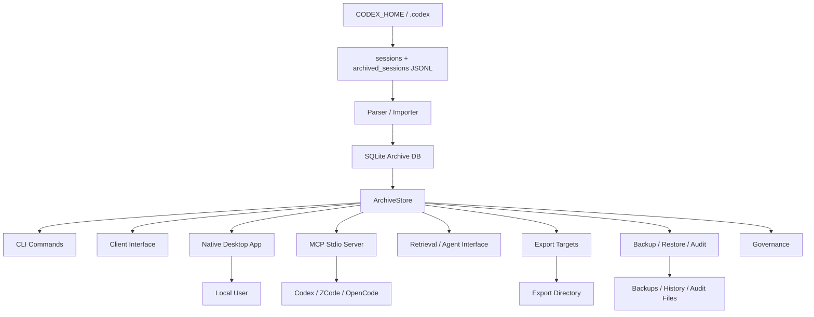

# Architecture

ThreadVault is a local-first archive, retrieval, export, governance, native desktop, and agent-integration system for Codex sessions. The architecture keeps raw transcript handling, search/retrieval, export generation, and UI interaction behind reusable Python modules so the CLI, native desktop app, and agent-facing contracts do not duplicate business logic.

## Design Principles

- Keep raw Codex transcript data local by default.
- Keep SQLite as the personal archive database.
- Put durable archive behavior behind `ArchiveStore`.
- Treat the native Tkinter desktop app as the primary 1.0.0 local interface.
- Keep Web UI commands retired; `threadvault.personal_ui` and active `personal_ui_*` schemas are removed from the 1.0.0 runtime.
- Reuse JSON schema contracts for CLI, UI, and agent payloads.
- Separate read-only preview from write actions.
- Keep privacy scan, confirmation, and governance gates visible at the API and UI layers.

## Main Modules

| Area | Primary Files | Responsibility |
|---|---|---|
| CLI | `src/threadvault/cli.py` | Typer command surface, argument parsing, user-facing command orchestration. |
| Configuration | `config.py`, `app_config.py`, `privacy_config.py` | Default paths, `threadvault.toml`, privacy allowlist, vector config, governance config. |
| Parser/import | `parser.py`, `importer.py`, `codex_adapter.py`, `database.py` | Codex JSONL discovery, parsing, normalization, imports, FTS triggers. |
| Store | `src/threadvault/store.py` | High-level archive workflows and reusable business entrypoint for CLI/UI. |
| Ingestion automation | `ingestion.py`, `codex_hooks.py` | Hook-safe ingestion queue, queue listing, dry-run/apply processing. |
| Retrieval | `retrieval.py`, `hybrid_retrieval.py`, `agent_interface.py` | Stable query contracts, FTS retrieval, hybrid ranking, agent-facing output. |
| Summary/vector | `summarizer.py`, `summary_pipeline.py`, `vector_adapter.py` | Evidence-backed summaries, summary/evidence chunks, optional local deterministic vectors. |
| Client interface | `client_interface.py`, `client_runtime.py` | Client manifest, overview, session detail, export preview, warnings, local TUI runtime. |
| MCP interface | `mcp.py`, `mcp_contracts.py` | MCP stdio server, tool manifests, JSON-RPC request handling, read-only cross-agent integration surface. |
| Desktop app | `desktop_app.py`, `desktop_data.py` | Primary minimal Tkinter native window and desktop-facing data interface over existing client/export/safety contracts. |
| Export | `export_targets.py`, `exporter.py` | Single-session export, batch target preview/write, Markdown/Obsidian/Skill layouts, manifests. |
| Privacy | `privacy.py` | Sensitive content scanning, effective findings, redaction/fail decisions. |
| Backup/restore | `backup_manifest.py`, `backup_history.py`, `restore_plan.py`, `restore.py`, `restore_history.py` | Local backup verification, history, restore preflight, restore apply. |
| Audit | `audit.py` | Corpus audit reports, audit history, diff, prune. |
| Governance | `governance.py`, `shared_server.py` | Local governance status, preflight, policy readiness/runtime, audit records, optional read-only server surfaces. |
| Schemas | `schemas.py`, `docs/schemas/` | JSON contract registry and schema artifact generation. |

## Runtime Data Flow



## Archive Database vs Output Files

ThreadVault intentionally separates the searchable archive from generated artifacts.

| Thing | Default / Example | Owner | Meaning |
|---|---|---|---|
| Archive database | `<repo-root>\data\threadvault.db` by default in this checkout | `config.py`, `database.py`, `store.py` | The SQLite index/store for imported sessions; override with `--db`, `THREADVAULT_DB`, or `[storage].archive_db`. |
| Export directory | `<repo-root>\threadvault-ui-output` | `export_targets.py`, UI action params | Markdown/Obsidian/Skill files for human or Codex reuse. |
| Backup directory | User-provided or UI default | Backup modules | Copies of the archive database. |
| History/audit files | User-provided or default local paths | Audit/restore/governance modules | Local operational records. |

The database is useful because search/retrieval can query it. The export directory is useful because the user, Codex, Obsidian, or editors can read the generated files directly.

The archive database keeps raw event text and payloads, but the default FTS surface indexes `indexed_text`, a cleaned knowledge field derived from raw events. This preserves auditability while reducing low-value search noise such as empty events, token counts, screenshots/base64 blobs, and oversized tool outputs.

## Retired Personal UI Archive

The former browser Web UI is not an active CLI/browser entrypoint in 1.0.0. Its runtime module, active schemas, and Web UI tests were removed from the package; historical route, static asset, localization, action registry, and acceptance records remain under `docs/progress/archive/legacy-v4/`.

## Native Desktop App Architecture

The native desktop app is the primary compact Tkinter shell launched with `threadvault desktop launch` or the Windows launcher `启动ThreadVault桌面版.cmd`.
It also exposes `threadvault desktop smoke --json` for non-window runtime verification.

```text
Tkinter window
  -> desktop_app event handlers
  -> background worker thread
  -> desktop_data DesktopDataGateway
  -> ArchiveStore client_overview / client_session / client_export_preview / client_warnings / backup / restore_plan / restore / reindex / vacuum / schemas / robot docs / governance status
```

Key desktop rules:

- No Electron, React, Tauri, WebView, or frontend build pipeline is required.
- The window is intentionally compact: browse, export preview, safety, MCP, health, and advanced command reference live in ordered tabs.
- Long archive/search/export/safety operations run off the Tk main thread.
- Tkinter state is read on the UI thread before dispatch; background workers receive plain values and post results back to the UI thread.
- The desktop smoke command verifies Tkinter availability, desktop gateway loading, and no-browser/no-server boundaries without opening a window.
- Export remains preview-first; the desktop app does not bypass privacy scan, preview, or explicit write gates.
- Backup, reindex, and vacuum use native confirmation prompts before writing locally.
- Desktop restore apply is limited to verified backups restored into new non-overwrite target databases.
- Schema, robot docs, and governance status are available as read-only native advanced panels.
- Schema writes use a native confirmation prompt and explicit output directory.
- Governance diagnostics aggregate status, readiness, gap, and v3 completion checks into a read-only native panel.
- Overwrite restore and governance/audit writes remain command-based until they have full native confirmation and target-path gates.
- Capability discovery exposes `interface_policy.primary_local_interface = native_desktop`, `personal_web_ui` as `retired`, and `retired_interface_archive = docs/progress/archive/legacy-v4/`.

## MCP Interface Architecture

The MCP interface is a shallow transport adapter over existing deep modules. It owns protocol concerns only:

```text
MCP client
  -> stdio JSON-RPC initialize / tools/list / tools/call
  -> mcp.py dispatch
  -> ArchiveStore
  -> agent_interface / client_interface / diagnostics
  -> MCP content + structuredContent
```

First-version tools:

- `threadvault_capabilities`
- `threadvault_stats`
- `threadvault_doctor`
- `threadvault_retrieve`
- `threadvault_session`
- `threadvault_export_preview`

Design decisions:

- The MCP module does not parse transcript files.
- The MCP module does not access SQLite tables directly.
- Tool results preserve ThreadVault JSON contracts in `structuredContent`.
- Export preview remains read-only and does not write Markdown, Obsidian, or Skill files.
- Raw local paths remain hidden by default and require explicit `local_debug`.
- Future write tools must reuse preview, privacy, governance, and confirmation gates rather than introducing a separate write path.

## Action Safety Model

`ACTION_REGISTRY` classifies personal UI actions:

- `preview_required`: export writes need a matching accepted preview.
- `confirm_required`: dangerous writes need explicit confirmation.
- `dangerous_action`: UI should visually distinguish and gate the action.
- `dry_run_default`: actions default to read-only planning unless explicitly applied.

Backend checks remain the final gate. Frontend locks, progress hints, and confirmation prompts exist to make the workflow understandable, not to replace backend validation.

## Retrieval Architecture

ThreadVault retrieval has three related paths:

| Path | Module | Behavior |
|---|---|---|
| FTS retrieval | `retrieval.py` | Uses SQLite FTS5 over cleaned `events.indexed_text`. Default and always available after import. |
| Vector retrieval | `vector_adapter.py` | Optional config-gated local deterministic vectors over summary/evidence chunks. |
| Hybrid retrieval | `hybrid_retrieval.py` | Combines FTS and optional vector candidates with explanation fields. |

Agent-facing retrieval in `agent_interface.py` wraps these paths into stable machine-readable payloads and avoids raw local path exposure unless local debug behavior is requested.

## Export Architecture

Export has two levels:

- `exporter.py`: single-session/project Markdown-style export helpers.
- `export_targets.py`: target-oriented Markdown, Obsidian, and Skill preview/write flows with manifests.

The target-oriented flow is:

```text
selection + profile + privacy mode
  -> preview_export_target
  -> client_export_preview
  -> accepted matching preview
  -> export_target write
  -> threadvault-export-manifest.json
```

This flow prevents "click export and hope" behavior. Users see what will be written, where it will be written, and what privacy findings apply.

## Governance Architecture

Governance is optional and local-first by default. It provides:

- Status and readiness diagnostics.
- Permission and enforcement preflight.
- Identity actor binding from local static config.
- Central policy and backup policy readiness/runtime previews.
- Local and central audit store helpers.
- Business command instrumentation.
- Optional read-only shared server manifests and smoke checks.

Governance diagnostics do not make cloud sync mandatory and do not replace the personal local archive path.

## Schema Contracts

Public JSON payloads are registered in `schemas.py` and materialized under `docs/schemas/`.

Rules:

- Additive fields are preferred over breaking changes.
- Tests should validate important payloads against their packaged schemas.
- UI and agent code should consume stable contract fields instead of scraping human text.

## Documentation And Vocabulary

- `CONTEXT.md` defines canonical terms.
- `docs/KNOWLEDGE_GRAPH.md` maps entities, relationships, flows, and safety boundaries.
- `docs/API.md` documents JSON contracts, MCP, capability discovery, and legacy Web UI routes/action semantics.
- `docs/DATABASE.md` documents the SQLite storage model.
- `docs/progress/rounds/` records active work.
- `docs/progress/archive/legacy-v*` preserves historical version-phase evidence.

Do not recreate `docs/v0` through `docs/v4` or `docs/development-progress.md`; those were migrated into `docs/progress/archive/`.
