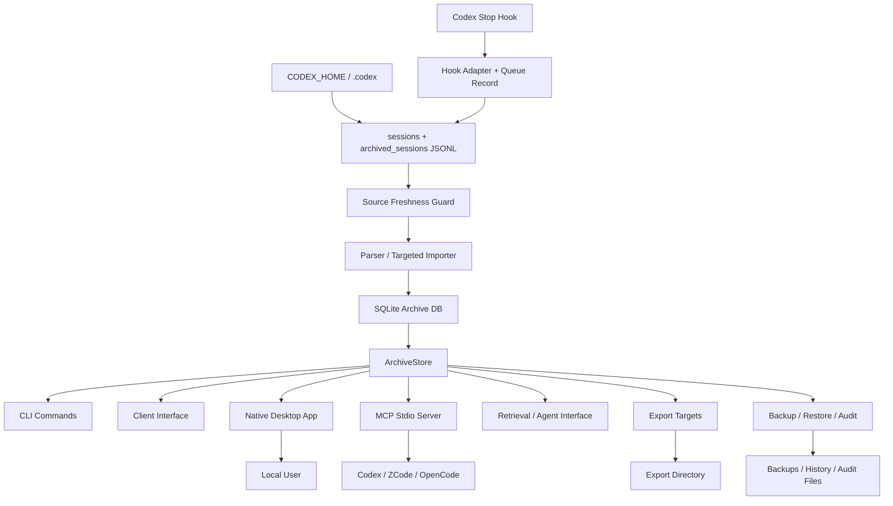

# Architecture

ThreadVault is a personal, local-first archive, retrieval, export, native desktop, and agent-integration system for Codex sessions. Raw transcript handling, search/retrieval, export generation, and UI interaction stay behind reusable Python modules so the CLI, desktop app, and agent-facing contracts do not duplicate business logic.

## Design Principles

- Keep raw Codex transcript data local by default.
- Keep SQLite as the personal archive database.
- Put durable archive behavior behind `ArchiveStore`.
- Treat the native Tkinter desktop app as the primary 2.x local interface.
- Keep the former Web UI runtime, launcher, active tests, active discovery metadata, and `personal_ui_*` schemas out of the runtime.
- Reuse JSON schema contracts for CLI, UI, and agent payloads.
- Separate read-only preview from write actions.
- Keep privacy scan, preview, confirmation, backup verification, and restore gates visible at the API and UI layers.
- Keep the active runtime personal-only: no team mode, central governance service, or shared HTTP server.
- Keep the hot database small enough for daily retrieval while preserving reversible bulky evidence in a local content-addressed cold store.

## Main Modules

| Area | Primary Files | Responsibility |
|---|---|---|
| CLI | `src/threadvault/cli.py` | Typer command surface, argument parsing, user-facing command orchestration. |
| Configuration | `config.py`, `app_config.py`, `privacy_config.py` | Default paths, `threadvault.toml`, privacy allowlist, vector config, and retention settings. |
| Parser/import | `parser.py`, `importer.py`, `codex_adapter.py`, `database.py` | Codex JSONL discovery, parsing, normalization, full or targeted imports, FTS triggers. |
| Source freshness | `source_sync.py` | Read-only source/import-log comparison plus targeted catch-up for missing, changed, stale-parser, or newly touched transcripts. |
| Storage lifecycle | `storage_policy.py`, `cold_store.py`, `archive_lifecycle.py`, `smart_backup.py` | Event value classification, content-addressed cold blobs, hydration, rebuild, verification, garbage collection, backup profiles, and catch-up-first automatic backup policy. |
| Store | `src/threadvault/store.py` | High-level archive workflows and reusable business entrypoint for CLI/UI. |
| Ingestion automation | `ingestion.py`, `codex_hooks.py`, `codex_integration.py` | Hook-safe queue history, targeted transcript import, one-command Hook/MCP setup, status diagnostics, and fallback queue processing. |
| Retrieval | `retrieval.py`, `hybrid_retrieval.py`, `agent_interface.py` | Stable query contracts, FTS retrieval, hybrid ranking, agent-facing output. |
| Summary/vector | `summarizer.py`, `summary_pipeline.py`, `vector_adapter.py` | Evidence-backed summaries, summary/evidence chunks, optional local deterministic vectors. |
| Client interface | `client_interface.py`, `client_runtime.py` | Client manifest, overview, session detail, export preview, warnings, local TUI runtime. |
| MCP interface | `mcp.py`, `mcp_runtime.py`, `mcp_validation.py`, `mcp_contracts.py` | MCP stdio transport/dispatch, read-only queries, input and lifecycle validation, and stable contracts. |
| Desktop app | `desktop_app.py`, `desktop_theme.py`, `desktop_data.py` | Primary Tkinter workbench, centralized native visual system, and desktop-facing data interface over existing client/export/safety contracts. |
| Export | `export_targets.py`, `exporter.py` | Single-session export, batch target preview/write, Markdown/Obsidian/Skill layouts, manifests. |
| Privacy | `privacy.py` | Sensitive content scanning, effective findings, redaction/fail decisions. |
| Backup/restore | `backup_manifest.py`, `backup_history.py`, `restore_plan.py`, `restore.py`, `restore_history.py` | Local backup verification, history, restore preflight, restore apply. |
| Audit | `audit.py` | Corpus audit reports, audit history, diff, prune. |
| Schemas | `schemas.py`, `docs/schemas/` | JSON contract registry and schema artifact generation. |

## Runtime Data Flow



## Archive Database vs Output Files

ThreadVault intentionally separates the searchable archive from generated artifacts.

| Thing | Default / Example | Owner | Meaning |
|---|---|---|---|
| Archive database | `<repo-root>\data\threadvault.db` by default in this checkout | `config.py`, `database.py`, `store.py` | The SQLite index/store for imported sessions; override with `--db`, `THREADVAULT_DB`, or `[storage].archive_db`. |
| Cold evidence | Sibling `<db-stem>-cold` directory | `cold_store.py`, `archive_lifecycle.py` | Immutable SHA-256-addressed payloads and assets; no server is required. |
| Export directory | `<repo-root>\threadvault-ui-output` | `export_targets.py`, UI action params | Markdown/Obsidian/Skill files for human or Codex reuse. |
| Backup directory | User-provided or `data\storage-backups` | Backup modules, `smart_backup.py` | Manual copies plus bounded automatic Core/Evidence/Forensic generations. |
| History/audit files | User-provided or default local paths | Corpus audit and restore modules | Local operational records. |

## Hot/Cold Data Flow

```text
Codex JSONL
  -> normalize event
  -> storage policy
     -> core: canonical conversation + compact payload in SQLite
     -> evidence/quarantine: compact stub in SQLite + immutable cold blob
     -> noise: hash stub only
  -> clean indexed_text -> FTS5
```

Reads that need full evidence hydrate through `ArchiveStore`; ordinary search and MCP retrieval stay on the hot database. Rebuilds are copy-on-write. Activation is permitted only when source/target counts and canonical conversation digests agree and doctor/cold verification pass.

Backup profiles are deliberately layered: Core is the daily searchable archive, Evidence adds cold blobs, and Forensic additionally snapshots source JSONL as content-addressed gzip files. `smart_backup.py` first delegates source catch-up to `source_sync.py`; a catch-up failure blocks backup creation. It then owns the backup decision: bootstrap Evidence, select the highest-due monthly/weekly/daily tier, skip unchanged data, verify before retention, and retain only automatic 3/2/1 generations. Manual backups remain outside that deletion scope.

The database is useful because search/retrieval can query it. The export directory is useful because the user, Codex, Obsidian, or editors can read the generated files directly.

The archive database keeps raw event text and payloads, but the default FTS surface indexes `indexed_text`, a cleaned knowledge field derived from raw events. This preserves auditability while reducing low-value search noise such as empty events, token counts, screenshots/base64 blobs, and oversized tool outputs.

The normal automatic path is intentionally narrow: Codex passes `transcript_path` to the `Stop` hook, ThreadVault records the queue request, and the same short-lived hook process imports only that one JSONL file. `storage sync` and the catch-up step inside `storage auto` are the safety net: they compare all currently discoverable sources with import provenance and target only stale files. `codex install` configures the user hook and read-only MCP entry together but does not merge their responsibilities. The hook lives in `~/.codex/hooks.json`; MCP uses Codex's shared `~/.codex/config.toml` and never triggers ingestion.

## Historical Personal UI Archive

The former browser UI is not an active CLI/browser entrypoint. Its runtime module, launcher, active schemas, active discovery metadata, and Web UI tests were removed from the package; historical route, static asset, localization, action registry, and acceptance records remain under `docs/progress/archive/legacy-v4/`.

## Native Desktop App Architecture

The native desktop app is the primary compact Tkinter shell launched with `threadvault desktop launch` or the Windows launcher `启动ThreadVault桌面版.cmd`.
It also exposes `threadvault desktop smoke --json` for non-window runtime verification.

```text
Tkinter window
  -> desktop_app event handlers
  -> background worker thread
  -> desktop_data DesktopDataGateway
  -> ArchiveStore client_overview / client_session / client_export_preview / export_target / client_warnings / storage_sync / storage_auto_backup / codex integration / backup / restore_plan / restore / reindex / vacuum / schemas / robot docs
```

Key desktop rules:

- No Electron, React, Tauri, WebView, or frontend build pipeline is required.
- The window is intentionally compact: a header and action bar make archive/search/open/export/backup obvious, while friendly session/search tables, confirmed export, Backup Center, Codex integration, health, and advanced references live in ordered tabs.
- `desktop_theme.py` owns semantic colors and Tk/ttk state styling for controls, native text surfaces, popup menus, scrollbars, and confirmation dialogs; feature handlers do not own raw cosmetic values.
- Long archive/search/export/safety operations run off the Tk main thread.
- Tkinter state is read on the UI thread before dispatch; background workers receive plain values and post results back to the UI thread.
- Archive snapshots remain fresh on every refresh. The desktop gateway only reuses friendly title metadata while the local Codex state SQLite database plus WAL/SHM signature is unchanged, and table reconciliation preserves selection, focus, and scroll without rebuilding unchanged rows.
- Ordinary initialization does not rewrite already-current schema metadata; missing or stale versions still take the existing migration/update path.
- The desktop smoke command verifies Tkinter availability, desktop gateway loading, and no-browser/no-server boundaries without opening a window.
- `DesktopExportPlan` is the immutable desktop write token: changing the selected session, target, profile, or privacy mode invalidates it; export requires an executable plan and native confirmation.
- The Backup Center reuses `ArchiveStore.storage_auto_backup` for source catch-up, automatic tier choice, disk guard, verification, and bounded retention; the Tk layer does not duplicate storage policy.
- The Codex Integration page reuses `codex_integration.py` for exact pinned Hook/MCP status and one confirmed install action. Hook trust remains visible because Codex owns that security decision.
- Backup, reindex, and vacuum use native confirmation prompts before writing locally.
- Desktop restore apply is limited to verified backups restored into new non-overwrite target databases.
- Schema and robot docs are available as native advanced panels.
- Schema writes use a native confirmation prompt and explicit output directory.
- Restore defaults to a collision-free new database path and the desktop flow refuses overwrite.
- Capability discovery exposes `interface_policy.primary_local_interface = native_desktop` without Web UI fallback or retired-interface metadata.

## MCP Interface Architecture

The MCP interface is a shallow transport adapter over existing deep modules. It owns protocol concerns only:

```text
MCP client
  -> stdio JSON-RPC initialize / tools/list / tools/call
  -> mcp.py transport and dispatch
  -> mcp_validation lifecycle/input checks
  -> mcp_runtime read-only SQLite queries
  -> agent/client-compatible payloads
  -> MCP content + structuredContent
```

First-version tools:

- `threadvault_capabilities`
- `threadvault_stats`
- `threadvault_doctor`
- `threadvault_retrieve`
- `threadvault_session`
- `threadvault_export_preview`

Design decisions:

- The MCP module does not parse transcript files.
- The MCP runtime opens the existing database with SQLite read-only and `query_only` enforcement; it never creates or migrates a database.
- JSON-RPC lifecycle, request IDs, and tool arguments are validated before dispatch.
- Tool results preserve ThreadVault JSON contracts in `structuredContent`.
- Export preview remains read-only and does not write Markdown, Obsidian, or Skill files.
- Raw local paths remain hidden by default and require explicit `local_debug`.
- Future write tools must reuse preview, privacy, and confirmation gates rather than introducing a separate write path.

## Action Safety Model

Personal write operations use explicit backend gates: exports require a matching accepted preview; backup/restore operations verify source and target state; destructive maintenance requires explicit confirmation. Desktop prompts make these boundaries visible but do not replace backend validation.

## Retrieval Architecture

ThreadVault retrieval has three related paths:

| Path | Module | Behavior |
|---|---|---|
| FTS retrieval | `retrieval.py` | Uses SQLite FTS5 over cleaned `events.indexed_text`. Default and always available after import. |
| Vector retrieval | `vector_adapter.py` | Optional config-gated local deterministic vectors over summary/evidence chunks. |
| Hybrid retrieval | `hybrid_retrieval.py` | Combines FTS and optional vector candidates with explanation fields. |

Agent-facing retrieval in `agent_interface.py` wraps these paths into stable machine-readable payloads and avoids raw local path exposure unless local debug behavior is requested.

## Export Architecture

Export has two levels:

- `exporter.py`: single-session/project Markdown-style export helpers.
- `export_targets.py`: target-oriented Markdown, Obsidian, and Skill preview/write flows with manifests.

The target-oriented flow is:

```text
selection + profile + privacy mode
  -> preview_export_target
  -> client_export_preview
  -> accepted matching preview
  -> export_target write
  -> threadvault-export-manifest.json
```

This flow prevents "click export and hope" behavior. Users see what will be written, where it will be written, and what privacy findings apply.

## Personal-Only Boundary

The active 2.x package has no team mode, central policy/audit runtime, identity/permission contracts, or shared HTTP server. The archived v3 records remain historical evidence only. Personal safety is provided by privacy scanning, preview/confirmation gates, backup verification, conservative restore rules, and a read-only MCP stdio seam.

## Schema Contracts

Public JSON payloads are registered in `schemas.py` and materialized under `docs/schemas/`.

Rules:

- Additive fields are preferred over breaking changes.
- Tests should validate important payloads against their packaged schemas.
- UI and agent code should consume stable contract fields instead of scraping human text.

## Documentation And Vocabulary

- `CONTEXT.md` defines canonical terms.
- `docs/KNOWLEDGE_GRAPH.md` maps entities, relationships, flows, and safety boundaries.
- `docs/API.md` documents JSON contracts, MCP, and capability discovery.
- `docs/DATABASE.md` documents the SQLite storage model.
- `docs/progress/rounds/` records active work.
- `docs/progress/archive/legacy-v*` preserves historical version-phase evidence.

Do not recreate `docs/v0` through `docs/v4` or `docs/development-progress.md`; those were migrated into `docs/progress/archive/`.
