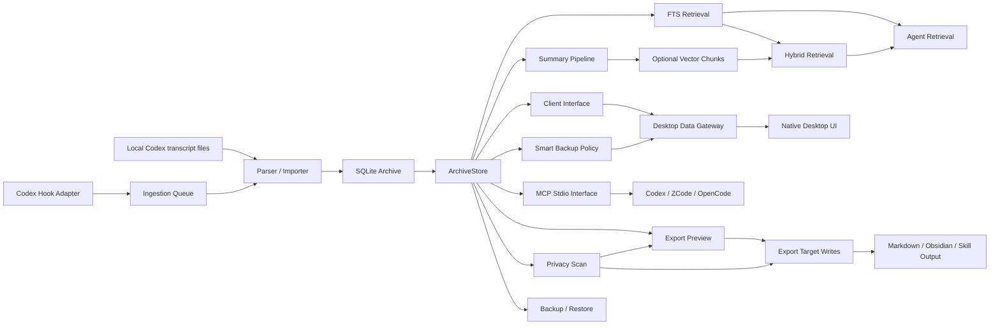

# Knowledge Graph

This document is the project-level knowledge graph for ThreadVault. It records the main domain entities, the modules that own them, the data flows between them, and the safety boundaries that keep the system local-first and privacy-first.

This is not a claim that ThreadVault stores a graph database. The runtime archive is SQLite. The "knowledge graph" here is a maintained map of project concepts and relationships so future desktop, CLI, retrieval, export, and MCP work can reuse the same model.

## Reading Guide

- Use this document when deciding where a new workflow belongs.
- Use `docs/DATABASE.md` for physical SQLite storage details.
- Use `docs/API.md` for JSON-facing contracts, MCP, and capability discovery.
- Use `docs/schemas/` and `threadvault schemas` commands for exact JSON contracts.
- Use `CONTEXT.md` for the canonical vocabulary.

## System Map



## Layered Model

| Layer | Core Entities | Owning Modules | Notes |
|---|---|---|---|
| Source | Codex Transcript File, Codex Home, Hook Event | `codex_adapter.py`, `codex_hooks.py`, `config.py`, `parser.py` | Input is local JSONL under `sessions` or `archived_sessions`. Stop hooks import only the named transcript and never rescan the whole home. |
| Archive | Archive Database, Session, Turn, Event, Clean Knowledge Field, Import Log, Parse Warning, FTS Index | `database.py`, `importer.py`, `store.py` | SQLite is the durable local archive; default search uses cleaned knowledge text derived from raw events. |
| Knowledge | Summary, Evidence Event, Summary Chunk, Vector Chunk | `summarizer.py`, `summary_pipeline.py`, `vector_adapter.py` | Summaries remain evidence-backed. Vector chunks are optional and derived from summaries/evidence, not raw-event indexing by default. |
| Retrieval | Retrieval Query, Retrieval Result, Hybrid Result, Agent Retrieval Payload | `retrieval.py`, `hybrid_retrieval.py`, `agent_interface.py` | FTS is the default path. Hybrid can combine FTS, vector, recency, project, and path signals. |
| Client | Client Manifest, Client Overview, Client Session Detail, Client Export Preview, Client Warnings | `client_interface.py`, `client_runtime.py` | Client surfaces package archive data into stable UI/agent-friendly payloads. |
| Export | Export Selection, Export Preview, Export Target, Export Manifest, Output File | `export_targets.py`, `exporter.py` | Write actions must follow preview acceptance and privacy handling. |
| Safety | Privacy Finding, Export Preview, Backup Verification, Restore Plan, Confirmation Gate | `privacy.py`, `export_targets.py`, backup/restore modules | Personal safety controls wrap exports and local write operations. |
| Operations | Backup, Backup Manifest, Restore Plan, Restore History, Audit History | `backup_manifest.py`, `backup_history.py`, `restore_plan.py`, `restore.py`, `restore_history.py`, `audit.py` | Local operational artifacts may contain private archive data and should be treated as private. |
| Interface | CLI Command, Native Desktop View, Desktop Export Plan, Backup Center, MCP Tool, JSON Schema | `cli.py`, `desktop_app.py`, `desktop_data.py`, `mcp.py`, `schemas.py` | Active UI and agents should reuse existing store/client contracts instead of duplicating parser, database, export, or backup policy. |

## Core Entity Catalog

| Entity | Definition | Primary Producer | Primary Consumers | Persistence |
|---|---|---|---|---|
| Codex Transcript File | Local Codex JSONL source file from `sessions` or `archived_sessions`. | Codex runtime outside ThreadVault | Parser, importer, audit | Local filesystem |
| Codex Home | Root directory used to discover local Codex transcript files. | User config / CLI option | Importer, hook adapter, ingestion queue | Config / command input |
| Hook Event | Turn-scoped signal carrying the transcript path to archive. | Codex hook adapter | Ingestion queue and targeted importer | SQLite `ingestion_queue` |
| Ingestion Request | A recorded request to import one transcript or scan a Codex home. | Hook adapter or CLI | Ingestion processor | SQLite `ingestion_queue` |
| Archive Database | Local SQLite database containing imported archive state. | `init_db`, import workflows | Store, CLI, UI, retrieval, export, backup | SQLite file |
| Cold Blob | Immutable SHA-256-addressed payload or asset externalized from the hot archive. | Storage policy/import/rebuild | Hydration, Evidence backup, verification | Local filesystem |
| Storage Class | Core, evidence, noise, or quarantine persistence decision attached to an event. | Storage policy | Audit, rebuild, pruning, backup selection | Event metadata |
| Session | Primary archived unit, normally one Codex conversation. | Parser/importer | Overview, session detail, summary, export, retrieval | SQLite `sessions` |
| Turn | Conversation grouping for related user/assistant/tool events. | Importer | Session detail, summary chunks, vector chunks | SQLite `turns` |
| Event | Normalized message, tool, system, or warning-related record. | Parser/importer | Search, session detail, summaries, exports | SQLite `events`, `events_fts` |
| Clean Knowledge Field | Derived searchable text plus index policy/value level for one event. | Database migration/import | FTS retrieval, diagnostics | SQLite `events.indexed_text`, `index_policy`, `value_level` |
| Import Log | Provenance and status record for a source import attempt. | Importer | Diagnostics, doctor, audit | SQLite `import_logs` |
| Parse Warning | Structured warning emitted while parsing/importing. | Parser/importer | Warning detail, client warnings, diagnostics | SQLite `parse_warnings` |
| FTS Index | SQLite full-text index over cleaned event text and selected fields. | Database triggers / rebuild | Search, retrieval, hybrid retrieval | SQLite `events_fts` |
| Summary | Local, rule-based, evidence-backed condensation of a session/project. | Summarizer | Client detail, export targets, summary chunks | Derived at read/export time |
| Evidence Event | Event ID referenced by a summary, export, chunk, or result as supporting evidence. | Summarizer / retrieval | UI, exports, agents, validation | SQLite event reference |
| Summary Chunk | Stable chunk selected from session summary, turn summary, or evidence text. | Summary pipeline | Vector index, retrieval diagnostics | JSON payload / vector indexing |
| Vector Chunk | Optional embedded summary/evidence chunk. | Vector adapter | Vector query, hybrid retrieval | SQLite `vector_chunks` |
| Retrieval Query | Stable query object with text, filters, mode, and limits. | CLI, agent, UI | Retrieval module | Request payload |
| Retrieval Result | Ranked match with session/event references and snippet. | Retrieval module | CLI, UI, agent interface | Response payload |
| Hybrid Result | Ranked match with explanation across FTS, vector, recency, project, and path signals. | Hybrid retrieval | Agent interface, UI | Response payload |
| Agent Retrieval Payload | Agent-oriented retrieval response that hides raw local details unless debug is enabled. | Agent interface | Agents, UI `/api/retrieve` | JSON contract |
| Client Overview | UI/client summary of recent sessions and optional search results. | Client interface | Native desktop, future clients | JSON contract |
| Client Session Detail | UI/client payload for one session with summary, event previews, and evidence IDs. | Client interface | Native desktop, future clients | JSON contract |
| Client Export Preview | Client-facing export plan with files, privacy summary, and write readiness. | Client interface / export targets | Native desktop, export write gate | JSON contract |
| Client Warnings | Warning-focused session detail plus privacy scan summary. | Client interface | Native desktop | JSON contract |
| Export Selection | Session/project/range-style choice of archive material. | Export target request | Preview and export writers | Request payload |
| Export Preview | Read-only plan for files that would be written. | Export targets / client interface | Desktop gate, users, agents | JSON contract |
| Desktop Export Plan | Immutable desktop state binding session, target, profile, privacy, planned files, and blocked status. | Desktop data gateway | Native desktop confirmation gate | Runtime value |
| Export Target | Concrete output profile: Markdown, Obsidian, or Codex Skill. | Export target module | Export writers | Filesystem output |
| Export Manifest | Machine-readable record of written files, skipped items, privacy counts, and evidence. | Export target writer | Users, future tools, validation | Output folder file |
| Output File | User-facing Markdown/Obsidian/Skill artifact. | Export writers | User, Codex, editors | Local filesystem |
| Privacy Finding | Sensitive-content finding with warn/redact/fail behavior. | Privacy scanner | Export, client warnings, UI | Response payload; sometimes manifest metadata |
| Backup | SQLite database copy for local recovery. | Backup workflow | Restore, verification, history | Local filesystem |
| Backup Center | Native presentation of smart-backup status, schedule, disk guard, tier, and one-click execution. | Desktop data gateway | Local user | Runtime UI |
| Backup Manifest | Metadata/provenance file beside a backup. | Backup manifest writer | Backup verification | Local filesystem |
| Restore Plan | Dry-run plan for applying a backup to a target DB. | Restore planner | Restore apply, UI review | JSON payload |
| Restore History | Record of restore operations. | Restore workflow | Restore history UI/CLI | Local filesystem |
| Corpus Audit Report | Anonymized corpus-level report over local files. | Audit module | Audit history, diff | Local filesystem |
| Native Desktop App | Primary local Tkinter shell over desktop data gateway. | `desktop_app.py`, `desktop_data.py` | Local user | Runtime UI |
| MCP Tool | Read-only stdio tool exposed to MCP-capable local agents. | `mcp.py` | Codex, ZCode, OpenCode, other MCP clients | Runtime manifest / JSON-RPC |
| JSON Schema | Packaged contract used to validate command/API payloads. | `schemas.py` | CLI, tests, agents, docs | `docs/schemas/` |

## Relationship Matrix

| From | Relationship | To | Owner / Contract |
|---|---|---|---|
| Codex Transcript File | is parsed into | Event | `parser.py`, `database.py` |
| Codex Transcript File | creates or updates | Session | `importer.py`, `database.py` |
| Event | belongs to | Session | `events.session_id` |
| Event | may belong to | Turn | `events.turn_id`, `events.turn_index` |
| Session | contains | Turn | `turns.session_id` |
| Turn | groups | Event | `turns`, `events.turn_index` |
| Import Log | records provenance for | Codex Transcript File | `import_logs.raw_path`, `raw_sha256` |
| Parse Warning | references | Session | `parse_warnings.session_id` |
| Event | indexes into | FTS Index | `events_fts` triggers |
| Event | derives | Clean Knowledge Field | `database.classify_index_text` |
| Clean Knowledge Field | indexes into | FTS Index | `events_fts` triggers |
| FTS Index | powers | Retrieval Result | `retrieval.py` |
| Summary | references | Evidence Event | `summary.evidence_event_ids` |
| Summary Chunk | derives from | Summary / Turn / Event | `summary_pipeline.py` |
| Vector Chunk | embeds | Summary Chunk | `vector_adapter.py` |
| Retrieval Result | references | Session / Event | `retrieval_query` contract |
| Hybrid Result | combines | FTS Result / Vector Result | `hybrid_retrieval` contract |
| Agent Retrieval Payload | wraps | Retrieval Result / Hybrid Result | `agent_retrieval` contract |
| Client Overview | lists | Session | `client_overview` contract |
| Client Session Detail | includes | Summary / Event Preview | `client_session` contract |
| Client Warnings | includes | Parse Warning / Privacy Finding | `client_warnings` contract |
| Export Preview | plans | Output File | `client_export_preview`, `export_target_manifest` |
| Desktop Export Plan | binds and gates | Export Target | `DesktopDataGateway.prepare_export/execute_export` |
| Export Target | writes | Output File | `export_targets.py`, `exporter.py` |
| Export Manifest | records | Output File / Privacy Finding / Evidence Event | `export_target_manifest` |
| Privacy Finding | gates or modifies | Export Target | `privacy_mode` warn/redact/fail |
| Restore Plan | must precede | Restore Apply | `restore_plan`, `restore` |
| Backup Manifest | verifies | Backup | `backup_manifest.py` |
| Event | references | Cold Blob | `events.payload_ref` or compact payload asset refs |
| Storage Backup Manifest | binds | Hot DB, cold blobs, optional forensic JSONL | `archive_lifecycle.py` |
| Smart Backup Decision | selects and verifies | Core / Evidence / Forensic Backup | `smart_backup.py`, `storage_auto` contract |
| Backup Center | presents and invokes | Smart Backup Decision | `desktop_data.py`, `desktop_app.py` |
| Smart Backup Retention | prunes only | Superseded automatic backup generations | Automatic keep counts are Core 3, Evidence 2, Forensic 1; manual backups are out of scope. |
| Native Desktop App | routes through | Desktop Data Gateway | `desktop_data.py`, `threadvault desktop launch` |
| Desktop Data Gateway | routes to | ArchiveStore Method | `DesktopDataGateway` |
| MCP Tool | routes to | Read-only MCP Runtime | `mcp.py`, `mcp_runtime.py`, `threadvault mcp serve` |
| MCP Tool | returns | Agent Retrieval / Client Session / Client Export Preview Payload | `structuredContent` |
| JSON Schema | validates | JSON Payload | `schemas.py`, `docs/schemas/` |

## Database Mapping

| Logical Entity | SQLite Area | Notes |
|---|---|---|
| Archive Database | SQLite file | Default is `data/threadvault.db` under the project root; `--db`, `THREADVAULT_DB`, and `[storage].archive_db` can override it. |
| Cold Evidence Store | Content-addressed files | Default is sibling `<db-stem>-cold`; derived files can be verified and garbage-collected by reachability. |
| Session | `sessions` | Durable session metadata, project cwd, source kind, timestamps, event and warning counts. |
| Turn | `turns` | Grouping and aggregate text fields for user/assistant/tool activity. |
| Event | `events` | Normalized event text, type, tool, file path, raw JSON, and turn references. |
| Clean Knowledge Field | `events.indexed_text`, `events.index_policy`, `events.value_level` | Derived high-value search text and classification. |
| FTS Index | `events_fts` | FTS5 virtual table over `indexed_text`, maintained by event insert/update/delete triggers. |
| Import Log | `import_logs` | Raw path/hash/status provenance. |
| Parse Warning | `parse_warnings` | Parser/import warnings tied to sessions. |
| Ingestion Request | `ingestion_queue` | Hook/CLI queued work and processing status. |
| Vector Index Metadata | `vector_index_meta` | Adapter and dimensions for the optional local vector index. |
| Vector Chunk | `vector_chunks` | Embedded summary/evidence chunks with metadata and evidence event IDs. |

## Primary Data Flows

### 1. Import And Archive

```text
Codex home
  -> discover sessions / archived_sessions
  -> parse JSONL records
  -> normalize sessions, turns, events, parse warnings
  -> derive clean indexed_text and value levels
  -> write SQLite tables
  -> update events_fts through triggers
  -> expose list/search/stats/doctor/client views
```

Important boundaries:

- The importer reads local files only.
- Raw transcript text remains local.
- Hook-triggered ingestion records queue history and imports only `transcript_path`; it must not perform a full Codex-home scan inside the hook process.

### 2. Search, Retrieval, And Agent Use

```text
Query text + filters
  -> retrieval query
  -> FTS result set
  -> optional vector result set
  -> optional hybrid rank/explanation
  -> agent retrieval payload
  -> UI, CLI, MCP client, or future client
```

Important boundaries:

- FTS remains the default, always-available retrieval path.
- Vector retrieval is optional and config-gated.
- Vector chunks are derived from summaries/evidence; raw events are not vectorized by default.
- Agent payloads should not expose raw local paths unless local debug behavior is explicitly requested.

### 2.1 MCP Cross-Agent Use

```text
Codex / ZCode / OpenCode
  -> MCP stdio initialize + tools/list
  -> threadvault_retrieve / threadvault_session / threadvault_export_preview
  -> validated read-only MCP runtime
  -> structuredContent returned to the agent
```

Important boundaries:

- MCP separates transport/dispatch, validation, and read-only query execution.
- MCP tools are read-only in the first version.
- MCP opens only an existing database and cannot initialize or migrate it.
- `threadvault_export_preview` can plan Obsidian/Skill output but must not write files.
- Export writes stay explicit CLI/UI actions with privacy and preview gates.
- Obsidian remains a Markdown output consumer, not a direct SQLite client.

### 3. Summary And Evidence

```text
Session + events
  -> local rule summary
  -> evidence event IDs
  -> session detail, export preview, export target, summary chunks
```

Important boundaries:

- Summaries must remain traceable to stored event IDs.
- External LLM summaries are not the default path.
- Missing or weak evidence should remain visible as warnings rather than being hidden.

### 4. Export Preview And Export Write

```text
Selection + target profile + privacy mode
  -> export preview
  -> privacy scan
  -> user review / UI preview acceptance
  -> matching export write action
  -> output files + export manifest
```

Important boundaries:

- Preview is read-only.
- Write actions require preview acceptance in the UI/backend flow.
- Privacy mode controls behavior:
  - `warn`: report findings and write content.
  - `redact`: redact supported sensitive text before writing.
  - `fail`: block high-risk findings.
- Export output belongs in the configured/export directory, not inside the archive database.

### 5. Native Desktop UI

```text
Tkinter window
  -> desktop_app handlers
  -> desktop_data DesktopDataGateway
  -> ArchiveStore/client/export/personal safety methods
  -> text/list views and local filesystem outputs
```

Important boundaries:

- The native desktop UI is the primary 2.x local interface.
- The desktop UI does not start a browser, local HTTP server, WebView, Electron, React, Tauri, or frontend build pipeline.
- Long operations run through background worker threads; Tk state is read on the UI thread before dispatch.
- Write-like actions still use preview, privacy, confirmation, and target-path gates.

### 5.1 Historical Personal UI Archive

The former browser UI runtime, launcher, active tests, and active discovery metadata are removed from the active package. v4 historical evidence lives under `docs/progress/archive/legacy-v4/`.

### 6. Backup, Restore, And History

```text
Archive database
  -> backup copy + optional manifest
  -> verify backup
  -> restore plan
  -> explicit restore apply
  -> restore history
```

Important boundaries:

- Backups may contain private transcript content.
- Restore apply is intentionally separated from restore planning.
- Destructive cleanup/prune operations require explicit apply/confirmation.

### 7. Personal-Only Runtime Boundary

The 2.x runtime has no team identity, permission, central policy/audit, or shared HTTP service. Historical v3 records remain archived evidence. External model calls are not part of the default path, and MCP remains a local read-only stdio interface.

## Interface Surface Map

| Surface | Entry | Reads | Writes | Safety Notes |
|---|---|---|---|---|
| CLI | `threadvault ...` | Archive DB, config, local files | Archive DB, export files, backups, audit/history files | Command flags and JSON contracts define exact behavior. |
| Native desktop UI | `threadvault desktop launch` | Archive DB, config | May write exports, backups, schemas, restore targets, maintenance operations | Primary local interface; routes through `DesktopDataGateway` and native confirmations. |
| Agent interface | `threadvault agent retrieve ... --json` | Retrieval/hybrid/vector status | No writes | Designed for stable machine use and evidence references. |
| Client interface | `threadvault client ... --json` | Store and retrieval | Export preview is read-only; export writes use export target commands/actions | Designed for the desktop and local clients. |
| Schema interface | `threadvault schemas ...` | Packaged schema registry | Optional schema artifact writes | Validates JSON contracts. |

## Safety And Privacy Boundaries

| Boundary | Rule |
|---|---|
| Raw transcript content | Stays local unless the user explicitly exports or shares local output files. |
| Archive DB vs export folder | The archive DB is the searchable index/store; export folders are user-facing files for Codex, Markdown tools, or Obsidian. |
| Preview vs write | Preview describes planned output; write actions create files only after the matching preview/confirmation path. |
| Privacy scan | Export and warning workflows must surface privacy findings instead of silently discarding them. |
| Confirmation | Restore apply, destructive maintenance, prune, and similar operations require explicit confirmation. |
| Vector indexing | Optional; disabled by default unless configured. It indexes derived chunks, not every raw event by default. |
| External model calls | Not default; any future use must remain explicit. |
| Server/shared use | Not part of the active product; MCP is local stdio and read-only. |

## What ThreadVault Is Not

| Misreading | Correct Model |
|---|---|
| "The knowledge graph is a graph database." | It is a maintained conceptual map. Runtime storage is SQLite. |
| "The DB path shown in the UI is an export." | The shown DB path is the archive/index database. Exports are files in an output directory. |
| "The UI owns archive logic." | The UI calls existing store/client/action contracts. |
| "Preview writes files." | Preview is read-only; write actions are separate. |
| "Vector search replaces FTS." | FTS remains the default. Vector/hybrid is optional. |
| "MCP means ThreadVault exposes a shared server." | MCP is a local stdio child process over an existing read-only database. |
| "Backups are safe to share because they are operational artifacts." | Backups can contain private transcripts and should be treated as private. |

## Completeness Checklist For Future Changes

When adding a new capability, update this graph if the change introduces or materially changes any of the following:

- A new durable entity, table, schema, or artifact.
- A new write path from UI, CLI, agent, or server.
- A new privacy, preview, confirmation, backup, or restore boundary.
- A new relationship between archive data and exported knowledge assets.
- A new retrieval adapter, ranking signal, or evidence reference type.
- A new client surface that bypasses or wraps existing store methods.

Before implementation, answer:

1. Which entity owns the data?
2. Is this read-only, write-only, or read-write?
3. Which JSON schema validates the public payload?
4. Which privacy and confirmation gates apply?
5. Does the output live in the archive DB, a generated export folder, or an operational history/audit file?
6. Which existing module should be reused instead of creating duplicate logic?
