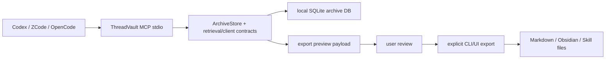

# ThreadVault MCP Integration Guide

本文说明如何把 ThreadVault 接成 Codex、ZCode、OpenCode 和 Obsidian 工作流的本地记忆层，也说明 AI 在读到本项目文档后应该如何生成配置片段。

ThreadVault 的 MCP 入口是本机 stdio server：

```powershell
threadvault mcp manifest --json
threadvault mcp serve
```

如果需要指定数据库：

```powershell
threadvault mcp serve --db <repo-root>\data\threadvault.db
```

## 1. 联动模型

ThreadVault 不让每个 agent 各自解析 Codex transcript。推荐模型是：



边界：

- MCP 只做本机读历史、看诊断、看会话、预览导出。
- `threadvault_export_preview` 不写文件。
- 真正写 Markdown、Obsidian vault 或 Skill candidate 仍走显式 CLI/UI 导出。
- 默认输出不包含 raw path metadata；只有传入 `local_debug=true` 才返回本地调试元数据。
- MCP 不能绕过 privacy scan、preview gate、confirmation gate 或 governance preflight。

## 2. 先验证 ThreadVault

先确认 CLI 在当前环境可用：

```powershell
threadvault --help
threadvault mcp manifest --json
```

manifest 应包含：

- `transport = "stdio"`
- `protocol_version = "2025-06-18"`
- `contract_version = "threadvault_mcp_manifest.v1"`
- `privacy.writes_files = false`
- `privacy.external_model_calls = false`

当前工具集：

| Tool | 用途 | 写文件 |
|---|---|---|
| `threadvault_capabilities` | 返回 ThreadVault 命令、格式、功能发现信息。 | 否 |
| `threadvault_stats` | 返回归档库统计和 clean index 诊断。 | 否 |
| `threadvault_doctor` | 检查本地 DB、FTS 和 Codex 会话发现状态。 | 否 |
| `threadvault_retrieve` | 用 agent retrieval interface 搜索历史上下文。 | 否 |
| `threadvault_session` | 按 session id 返回摘要、证据和事件预览。 | 否 |
| `threadvault_export_preview` | 预览 Markdown、Obsidian 或 Skill 导出计划。 | 否 |

## 3. Codex 配置

Codex 使用 `config.toml` 配置 MCP。默认位置是 `~/.codex/config.toml`；受信任项目也可以使用项目级 `.codex/config.toml`。Codex CLI 和 IDE extension 共享这份配置。

推荐配置：

```toml
[mcp_servers.threadvault]
command = "threadvault"
args = ["mcp", "serve"]
cwd = "<repo-root>"
startup_timeout_sec = 10
tool_timeout_sec = 60
enabled = true
```

如果 `threadvault` 不在 PATH，可以用 Python 运行已安装环境里的 console script，或把 `command` 改成完整可执行文件路径。若你希望固定数据库：

```toml
[mcp_servers.threadvault]
command = "threadvault"
args = ["mcp", "serve", "--db", "<repo-root>\\data\\threadvault.db"]
cwd = "<repo-root>"
enabled = true
```

也可以用 Codex CLI 添加：

```powershell
codex mcp add threadvault -- threadvault mcp serve
```

检查方式：

```text
在 Codex TUI 输入 /mcp，确认 threadvault server 和 tools 可见。
```

建议给 Codex 的使用提示：

```text
需要查本项目旧会话、旧决策、测试证据或导出计划时，先使用 threadvault MCP。
写文件前只使用 threadvault_export_preview；真正导出必须让用户确认后运行 ThreadVault CLI/UI。
```

## 4. OpenCode 配置

OpenCode 的官方配置使用 `opencode.json` / `opencode.jsonc` 中的 `mcp` 字段。本地 stdio server 使用 `type: "local"`，`command` 是包含可执行文件和参数的数组。

示例：

```jsonc
{
  "$schema": "https://opencode.ai/config.json",
  "mcp": {
    "threadvault": {
      "type": "local",
      "command": ["threadvault", "mcp", "serve"],
      "cwd": "<repo-root>",
      "enabled": true,
      "timeout": 60000
    }
  }
}
```

固定数据库：

```jsonc
{
  "$schema": "https://opencode.ai/config.json",
  "mcp": {
    "threadvault": {
      "type": "local",
      "command": [
        "threadvault",
        "mcp",
        "serve",
        "--db",
        "<repo-root>\\data\\threadvault.db"
      ],
      "cwd": "<repo-root>",
      "enabled": true,
      "timeout": 60000
    }
  }
}
```

使用提示：

```text
use threadvault when you need prior Codex session evidence, local project history, or export previews.
```

## 5. ZCode 配置

Z.AI 文档把 MCP 作为 GLM Coding Plan 的核心集成入口之一，并给出了 stdio MCP server 的通用配置形态。由于 ZCode 的具体配置界面和文件格式可能随版本变化，ThreadVault 文档只固定服务端命令，不替用户猜测未核实的 UI 菜单名称。

在 ZCode 的 MCP 服务设置里添加本地 stdio server：

```text
Name: threadvault
Transport: stdio / local command
Command: threadvault
Arguments: mcp serve
Working directory: <repo-root>
```

如果界面接受一行命令：

```powershell
threadvault mcp serve
```

如果需要固定数据库：

```powershell
threadvault mcp serve --db <repo-root>\data\threadvault.db
```

给 ZCode agent 的使用提示：

```text
需要读取本机 Codex 历史、复用旧实现证据、查看 session detail 或预览 Obsidian/Skill 导出时，使用 threadvault MCP。
不要通过 MCP 写文件；写导出文件前先请求用户确认。
```

## 6. Obsidian 联动

Obsidian 在 ThreadVault 设计里主要是输出消费端，而不是直接读 SQLite 的 MCP 客户端。

推荐工作流：

1. 在 Codex、ZCode 或 OpenCode 里调用 `threadvault_export_preview`。
2. 检查计划写入的 Obsidian Markdown 文件、隐私发现和风险。
3. 用户确认后运行显式导出命令。

示例：

```powershell
threadvault export-target obsidian --session SESSION_ID --out <repo-root>\threadvault-ui-output --json
```

如果要让 AI 直接读写 Obsidian vault，需要另行安装 Obsidian 侧 MCP 插件或 Local REST API 类插件。那是 Obsidian vault 的 MCP server，不是 ThreadVault MCP server；不要混成同一个安全边界。

## 7. AI 自配置协议

如果你是 AI agent，要根据本项目文档为用户生成 MCP 配置，按这个顺序执行：

1. 读取 `README.md`，确认 ThreadVault 版本、安装方式、重要路径。
2. 读取 `docs/MCP_INTEGRATION.md`，获取配置模板和安全边界。
3. 读取 `docs/API.md` 的 MCP stdio interface，确认工具和写入行为。
4. 读取 `docs/ARCHITECTURE.md` 的 MCP interface architecture，确认 MCP 只是 transport adapter。
5. 读取 `docs/KNOWLEDGE_GRAPH.md` 的 MCP cross-agent flow，确认数据流和边界。
6. 运行 `threadvault mcp manifest --json`，用真实 manifest 覆盖记忆里的工具列表。
7. 按目标客户端生成最小配置片段。
8. 先输出 dry-run snippet，不直接写用户的全局 MCP 配置。
9. 只有用户明确要求 apply/install，才修改客户端配置文件。

生成配置时必须遵守：

- 不创建新的归档数据库，除非用户要求。
- 不把 export directory 当成 archive DB。
- 不把 Obsidian vault 当成 ThreadVault DB。
- 不打开 `local_debug=true`，除非用户明确要求本地调试。
- 不把 read-only MCP 说成可以写文件。
- 不承诺 ZCode/OpenCode 未核实的 UI 菜单名称；优先给可迁移的 stdio 命令和参数。

## 8. 故障排查

### 客户端看不到工具

1. 运行：

   ```powershell
   threadvault mcp manifest --json
   ```

2. 确认 `threadvault` 在客户端启动环境的 PATH 中。
3. 用完整路径或固定 Python 环境重写 `command`。
4. 重启 MCP 客户端或新开会话。

### server 启动后没有数据

检查数据库：

```powershell
threadvault stats
threadvault doctor
```

如果没有导入过：

```powershell
threadvault init
threadvault import
```

### 检索不到想要的旧内容

先用 CLI 对照：

```powershell
threadvault agent retrieve "关键词" --json
threadvault search "关键词"
```

如果 CLI 能搜到而 MCP 搜不到，检查客户端是否连到了同一个 `--db`。

### 导出预览通过但没有文件

这是正常行为。`threadvault_export_preview` 不写文件。确认后运行：

```powershell
threadvault export-target obsidian --session SESSION_ID --out <repo-root>\threadvault-ui-output --json
threadvault export-target skill --session SESSION_ID --out <repo-root>\threadvault-ui-output --json
```

## 9. 已核实来源

- Codex MCP 配置：`https://developers.openai.com/codex/mcp`
- OpenCode MCP servers：`https://opencode.ai/docs/mcp-servers/`
- Z.AI MCP integration docs：`https://docs.z.ai/devpack/mcp/vision-mcp-server`
- ThreadVault 运行时 manifest：`threadvault mcp manifest --json`
