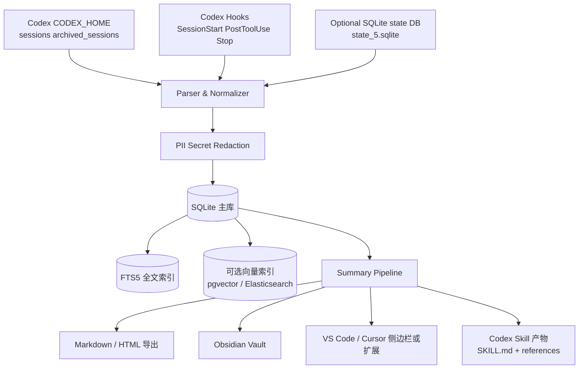

# Codex 会话总结归档工具系统性开发研究报告

## 执行摘要

面向 Codex 的“会话总结归档工具”，最稳妥的建设路线不是直接做一个“导出器”，而是做成**本地优先、兼容多变体、可检索、可再总结、可再导出**的分层系统。原因很明确：Codex 会话数据默认分布在 `CODEX_HOME` 下，既包含 `sessions/` 与 `archived_sessions/` 中的 JSONL 会话转录，也包含独立的 SQLite 状态库；同时，官方 Hooks 文档明确说 `transcript_path` 指向的转录文件“不是稳定接口，未来可能变化”，而社区与官方 issue 又已经暴露出旧版 rollout 结构、交互式会话缺失 `token_count`、fork 子会话复制父会话前缀、恢复会话缺失 `function_call_output` 等多种真实变体。换言之，这个工具的核心难点不是“把 JSONL 转成 Markdown”，而是**把不完全稳定的本地会话事实层先规范化**。citeturn26view1turn28view1turn23view0turn22view1turn22view3turn22view6

从开源生态看，现有工具已经覆盖了若干局部能力：MeXenon 的 `codex-session-export` 偏重 TUI 导出与过滤；`ezyyeah/codex-export` 偏重多格式与模板化导出；`jinghan23/codex-export` 偏重作为 Codex Skill 的轻量导出；`ccusage` 偏重成本与 token 统计，且官方文档已经把 Codex 数据源标为 Beta/实验性；`cass` 则已经证明“跨代理会话统一索引、全文检索、可选语义检索”是可落地路线。对“总结归档工具”而言，这些项目值得参考，但没有一个项目完整覆盖“可靠解析 + 结构化索引 + 证据化总结 + 多终端导出 + 安全去敏 + 长期归档”这条全链路。citeturn10view1turn11view0turn11view1turn11view2turn10view0turn39view0

因此，本报告的结论是：**MVP 阶段应优先选择 Python + SQLite FTS5 的本地 CLI 架构，先解决解析、规范化、增量索引、Markdown 导出与“有证据的摘要”生成；v1 再补 Hooks 驱动自动入库、Obsidian/VS Code/Cursor 集成与可配置粒度摘要；v2 再补可选服务器组件、pgvector/Elasticsearch 混合检索、团队权限与审计能力。** SQLite FTS5 适合本地全文检索；向量检索则建议做成 **可选层**，本地可从轻量 embedding 起步，团队或企业版再接入 pgvector/Elastic。citeturn18view4turn18view3turn18view5

### 关键决策建议

| 优先级 | 建议 | 依据 |
|---|---|---|
| P0 | **先做规范化事实层，再做摘要层。** 解析器必须把 `session_meta`、`turn_context`、`response_item`、`event_msg` 与 legacy rollout 统一成内部 schema。 | Codex 转录文件并非稳定接口，且已存在 pre-`session_meta` 旧格式、`token_count` 缺失、fork 复制父前缀、缺失 `function_call_output` 等真实变体。citeturn28view1turn23view0turn22view1turn22view3turn22view6 |
| P0 | **默认本地优先，不把原始会话上传到服务器。** 摘要、检索、导出都应支持纯本地运行。 | `CODEX_HOME` 下不仅有 sessions，还有 auth、logs、skills 等状态；官方也明确提醒分享日志前先确认不含敏感信息。citeturn26view1turn36search3 |
| P0 | **默认启用去敏与导出前审阅。** 特别是路径、密钥、环境变量、工具输出、raw reasoning。 | `show_raw_agent_reasoning` 可显式暴露 raw reasoning，且会话中可保存工具输出；示例还显示 reasoning 记录中存在 `encrypted_content`。citeturn26view0turn22view4 |
| P1 | **检索采用“关键词优先、语义可选、混合重排”路线。** 单机先用 FTS5，向量索引作为插件。 | SQLite FTS5 适合轻量本地全文检索；Elastic `dense_vector` 与 pgvector HNSW/IVFFlat 适合更大规模或服务端场景。citeturn18view4turn18view3turn18view5 |
| P1 | **摘要必须输出证据引用。** 不是只给一段 prose，而要保留“由哪些 turn / tool call / file edit 支撑”的证据链。 | Structured Outputs 可用 JSON Schema 约束摘要结构；OpenAI 长文总结实践也明确建议基于分块与可控细节层级。citeturn19search2turn19search1 |
| P1 | **把 Hooks 作为自动化入口，而不是把转录文件当稳定 API。** | 官方 Hooks 明确给出 `session_id`、`cwd`、`transcript_path` 等输入字段，但同时说明 transcript 格式不稳定；更适合把 Hook 当触发器，而非“唯一真相源”。citeturn28view1turn28view2 |
| P2 | **导出目标以 Markdown 为主格式，HTML/Obsidian/VS Code/Cursor/Codex Skill 为派生层。** | 现有开源工具与官方 Skill 机制都已经围绕 Markdown、`SKILL.md` 与本地文件工作流展开；VS Code 侧也已有历史浏览类扩展验证此方向。citeturn10view1turn11view0turn35view0turn32search1 |

## 目标范围与假设

本工具的目标可以定义为：**把 Codex 本地会话从“散落 JSONL 与状态库”提升为“可搜索、可压缩总结、可引用证据、可导出到知识库或 IDE”的长期资产。** 它不是要替代 Codex 原生的 `/resume`、`/fork`、`/compact` 等交互能力，而是对这些能力形成会后归档层：保留原始事实，整理摘要，支持回溯、复用与知识沉淀。Codex 官方已经支持 `/resume`、`/fork`、`/side`、`/compact` 与 `codex resume` / `codex fork` 等线程操作，这恰好说明“线程持续演化、分叉、压缩”是产品内建能力，而归档工具应围绕这种线程生命周期建模。citeturn30view0turn30view1turn31view3

本报告采用以下显式假设；凡用户未给出之处，统一标注为“未指定”。

| 维度 | 假设 |
|---|---|
| 操作系统 | 未指定；设计上以 macOS / Linux / Windows 均可运行为目标 |
| 用户规模 | 未指定；MVP 按单用户本地使用设计，v2 再考虑团队共享 |
| 并发 | 未指定；MVP 仅要求单机单进程可稳定增量导入，v1 起支持后台索引 |
| 数据量 | 默认允许从数百到数千会话增长；需考虑单个会话超大 JSONL 的情况 |
| 网络 | 默认支持完全离线；摘要可配置为本地模型或外部 API |
| 法域与合规约束 | 未指定；本报告不给出法律意见，仅给出工程控制建议 |
| Codex 版本跨度 | 需兼容 2025 legacy rollout、当前 JSONL rollout，以及后续小变体 |

围绕这个目标，关键需求应分成四层。功能层至少需要：目录扫描、增量导入、统一解析、会话/turn/tool/file-edit 索引、关键词搜索、可选语义搜索、摘要生成、Markdown/HTML 导出、批量归档、标签与收藏、按项目 `cwd` 聚合。非功能层至少需要：大文件流式解析、断点续扫、可观测日志、可复现实验、跨平台。安全层至少需要：默认本地存储、敏感字段红线匹配与可插拔去敏、导出前确认、加密备份、权限隔离。隐私与合规层至少需要：最小数据保留、可删除、可重建索引、审计导出、可配置外发策略。之所以必须把安全/隐私上升为一级需求，是因为 `CODEX_HOME` 同时承载 config、auth、logs、sessions 等本地状态，而官方也明确提醒“分享日志前先确认不含敏感信息”；再加上互联网访问场景存在 prompt injection 导致数据泄露的明确风险，归档工具不能只做“便利层”，必须自带防泄漏边界。citeturn26view1turn36search3turn36search9

下表给出建议性的需求基线。

| 类别 | 建议基线 |
|---|---|
| 功能 | 导入 `sessions/` 与 `archived_sessions/`；识别 fork / resume / compact；按项目、线程、时间、模型、工具、文件路径检索；生成带证据引用的 summary |
| 非功能 | 单个超大 JSONL 不整体读入内存；索引可重建；支持离线；本地检索响应尽量保持秒级内 |
| 安全 | 默认本地；导出前去敏预览；敏感规则可自定义；备份与索引可加密；依赖锁定与签名验证 |
| 隐私/合规 | 删除原文后可选择仅保留摘要；摘要可标记“仅本地”；导出产生审计记录；外部模型调用必须显式 opt-in |
| 运维 | 单二进制或 Python CLI 可安装；支持 cron/任务计划自动索引；可选服务器组件不应成为基础依赖 |

## 输入数据规范与现有工具对比

### Codex 会话数据的当前形态

Codex 把本地状态根目录放在 `CODEX_HOME`，默认是 `~/.codex`；其中会话转录通常位于 `sessions/` 与 `archived_sessions/`，而 SQLite 状态数据可单独放在 `CODEX_SQLITE_HOME` 或 `sqlite_home` 指定的目录中。官方 Troubleshooting 还明确给出了 app logs、session transcripts 与 archived sessions 的默认位置。对归档工具来说，这意味着**数据源至少有三类**：JSONL 转录、SQLite 状态库，以及可能辅助存在的索引文件与日志。citeturn26view1turn26view2turn26view3turn36search3turn24search6

当前官方测试与 issue 能确认的新式 JSONL 记录，核心由四种顶层记录构成：`session_meta`、`turn_context`、`response_item`、`event_msg`。官方测试样例展示了 `session_meta.payload` 中的 `session_id` / `id` / `timestamp` / `cwd` / `originator` / `cli_version` / `source` / `model_provider`；同一个测试还展示了 `event_msg.payload.type = "user_message"` 的形态。另一个 issue 提供了 `turn_context.payload` 中 `model`、`effort`、`approval_policy`、`collaboration_mode` 的实例如 `gpt-5.3-codex`。`response_item` 则已经公开出现 `message`、`reasoning`、`function_call`、`function_call_output` 等 payload 类型。citeturn21view0turn22view2turn15search1turn22view4turn22view6

建议采用如下**内部统一记录模型**作为解析入口：

| 顶层 `type` | 关键 payload 字段 | 说明 |
|---|---|---|
| `session_meta` | `session_id`、`id`、`cwd`、`source`、`model_provider`、可选 `forked_from_id` | 会话身份与环境元数据；fork 子会话会带 `forked_from_id`。citeturn21view0turn22view3 |
| `turn_context` | `model`、`effort`、`approval_policy`、`collaboration_mode` | 每轮上下文配置，适合做摘要时的“执行条件”证据。citeturn22view2 |
| `response_item` | `message` / `reasoning` / `function_call` / `function_call_output` | 会话内容主干；要允许 call-output 不配对。citeturn15search1turn22view4turn22view6 |
| `event_msg` | `user_message`、`turn_aborted`、`token_count`、可能还有 `agent_message` | 事件层；不同版本完整度不同。citeturn22view1turn15search6 |
| legacy 顶层记录 | `record_type: "state"`，或顶层 `type: message/reasoning/function_call` | 2025 旧格式，需单独分支解析。citeturn23view0 |

### 可能变体与解析风险

这里最关键的工程事实有四个。

第一，**官方不把 transcript format 视为稳定接口**。Hooks 文档说得非常直接：`transcript_path` 只是为了方便提供给 Hook，transcript format 不是稳定接口，未来可能变化。因此，解析器必须遵循“宽进严出”原则：输入允许字段漂移、缺失与额外字段；输出统一到自家 schema，永远不要把原始 JSON shape 直接暴露给上层业务。citeturn28view1

第二，**不同运行模式下，记录完整性并不一致**。公开 issue 显示，交互式会话文件里通常只有 `session_meta`、`turn_context`、`response_item` 以及若干 `event_msg`，但可能缺失 `token_count`；而 `ccusage` 之类依赖本地日志推导成本的工具，正因缺少 `token_count` 而出现“No usage data found”的局面。换言之，成本统计不能依赖单一字段；需要降级策略。citeturn22view0turn22view1turn11view2

第三，**恢复与 fork 会引入结构异常但并不代表文件损坏**。一个 issue 明确展示子会话的第一行是子自己的 `session_meta`，第二行是父会话的 `session_meta`，之后还会复制父会话历史，再接子分支新记录；这意味着若不做 dedup，摘要会把父历史重复算进去。另一个 issue 则展示恢复后的 rollout 中可能存在 `function_call` 却没有匹配的 `function_call_output`，因此解析器不能把 call-output 配平视为强一致约束。citeturn22view3turn22view6

第四，**旧版 rollout 真实存在且仍可能被用户保留**。官方 issue 已展示 2025 legacy 文件形态：开头是 `{"id":..., "timestamp":..., "instructions":null}`，随后出现 `{"record_type":"state"}`，再跟顶层 `{"type":"message" ...}` 或 `{"type":"function_call" ...}` 记录；`codex doctor` 当时甚至把它们当成 scan errors。对归档工具来说，忽略这些文件会导致用户历史断层。citeturn23view0

下面给出一个**可接受的示例片段**。它不是唯一合法格式，但足以覆盖主路径；真正实现时应允许字段缺失、顺序差异与未知扩展字段。citeturn21view0turn22view2turn15search1turn22view4turn22view6

```json
{"timestamp":"2026-01-27T12:34:56Z","type":"session_meta","payload":{"session_id":"019e...","id":"019e...","timestamp":"2026-01-27T12:34:56Z","cwd":"/repo/app","originator":"codex_cli_rs","cli_version":"0.137.0","source":"cli","model_provider":"openai"}}
{"timestamp":"2026-01-27T12:35:01Z","type":"turn_context","payload":{"model":"gpt-5.3-codex","effort":"xhigh","approval_policy":"never","collaboration_mode":{"mode":"default","settings":{"model":"gpt-5.3-codex","reasoning_effort":"xhigh"}}}}
{"timestamp":"2026-01-27T12:35:02Z","type":"event_msg","payload":{"type":"user_message","message":"检查本仓库的测试失败原因","kind":"plain"}}
{"timestamp":"2026-01-27T12:35:10Z","type":"response_item","payload":{"type":"reasoning","summary":[{"type":"summary_text","text":"**调查测试失败**"}],"content":null,"encrypted_content":"gAAAAA..."}}
{"timestamp":"2026-01-27T12:35:12Z","type":"response_item","payload":{"type":"function_call","name":"shell","arguments":"{\"command\":\"pytest -q\"}","call_id":"call_123"}}
{"timestamp":"2026-01-27T12:35:15Z","type":"response_item","payload":{"type":"function_call_output","call_id":"call_123","output":"2 failed, 18 passed"}}
{"timestamp":"2026-01-27T12:35:20Z","type":"response_item","payload":{"type":"message","role":"assistant","content":[{"type":"output_text","text":"失败集中在 auth 模块……"}]}}
```

### 现有开源工具与对比

| 项目 | 语言 | 许可证 | 活跃度 | 主要功能 | 优点 | 局限 |
|---|---|---|---|---|---|---|
| `cass` | Rust 为主 | **MIT License with OpenAI/Anthropic Rider**，不是标准纯 MIT。citeturn14view0turn14view1 | 43 个 release，最新 `v0.6.19` 于 2026-06-26；932 stars。citeturn10view0turn11view3 | 统一索引多种 coding agent 历史，支持本地全文检索与可选语义检索。citeturn10view0turn11view3 | 证明了“统一 schema + 本地搜索”的路线可行；支持跨代理。citeturn10view0turn11view3 | 目标是跨代理搜索，不是专门为 Codex 做证据化总结；许可证附加 rider 也可能影响企业采用。citeturn14view0 |
| `MeXenon/codex-session-export` | Python | Apache-2.0。citeturn10view1 | 11 个 release，最新 `v2.6.2` 于 2026-06-26；61 stars。citeturn10view1 | TUI 选择会话、按 section 过滤、批量导出 Markdown、项目视图、上下文解析。citeturn10view1 | 对 Codex JSONL 的会话查看/导出体验成熟；能区分 reasoning、工具调用、终端输出等多段。citeturn10view1 | 聚焦导出，不提供长期索引、检索、知识库级摘要。 |
| `ezyyeah/codex-export` | Go | MIT。citeturn12view0 | 2 commits、无 release、0 stars。citeturn11view0turn12view0 | 支持 Markdown / HTML / JSON / text / CSV / 自定义模板，多 agent `.jsonl`。citeturn11view0turn12view0 | 模板化导出思路很适合作为你项目的 exporter 层参考。citeturn11view0turn12view0 | 项目仍很早期，生态验证与稳定性信号较弱。 |
| `jinghan23/codex-export` | Node/JavaScript（仓库含 `package.json`，未见更细语言声明）citeturn11view1turn13view0 | **本次已核验来源未发现明确许可证声明**；`package.json` 仅含 name/version/description。citeturn11view1turn13view0turn14view2 | 6 commits；约 27 stars；以 Skill 方式安装。citeturn11view1turn13view0 | 面向 Codex CLI 与 Desktop 双来源导出，支持作为 Codex Skill 使用。citeturn11view1 | 非常适合“直接在 Codex 内调用导出能力”的场景；对你的 Skill 集成部分很有参考价值。citeturn11view1turn35view0 | 许可证不清晰；功能目前偏单点导出，不是归档系统。 |
| `ccusage` | Rust 为主，辅以 TypeScript/Nix 等。citeturn39view0 | MIT。citeturn39view0 | 128 个 release，最新 `v20.0.14` 于 2026-06-15；16.7k stars。citeturn39view0 | 从本地数据分析多个 coding agent 的 token usage 与成本；支持 `ccusage codex daily/session`。Codex 数据源官方文档标注为 Beta/实验性。citeturn39view0turn11view2 | 对统计维度、统一报表与多源扫描非常成熟。citeturn39view0turn11view2 | 目的不是会话知识归档；且 issue 已暴露针对大 Codex JSONL 的内存读取问题。citeturn37search11 |

结论很清楚：如果你的产品目标是“Codex 会话总结归档”，那么**最佳策略不是 fork 某个单一项目，而是组合借鉴**。具体说，解析/导出层可参考 MeXenon 与 `ezyyeah/codex-export` 的 section/filter/template 设计；成本统计与多数据源发现可参考 `ccusage`；索引与检索可参考 `cass`；Codex 内原生触发与分发可参考 `jinghan23/codex-export` 的 Skill 路径。citeturn10view1turn11view0turn11view1turn11view2turn10view0turn39view0

## 架构数据模型与检索设计

### 推荐架构

对单机优先场景，推荐采用“**采集层 → 规范化层 → 存储层 → 检索层 → 摘要层 → 导出层**”六段式。采集层读取 `sessions/`、`archived_sessions/`、可选 `state_5.sqlite` 与 Hook 事件；规范化层把新旧 JSONL 统一成内部 schema 并做去敏；存储层落 SQLite 主库；检索层先上 FTS5，再接可选向量；摘要层输出结构化 summary；导出层再生成 Markdown / HTML / Obsidian / Skill 等。之所以建议把 Hook 作为“增量触发器”接入，是因为官方 Hook 输入天然提供 `session_id`、`cwd`、`hook_event_name`、`transcript_path`、`model` 等字段，并支持 `SessionStart`、`PostToolUse`、`Stop` 等生命周期节点。citeturn28view1turn28view2turn28view3



### 数据模型

建议的最小化关系模型如下。它不是对 Codex 原始数据的简单镜像，而是为了后续搜索与摘要的“查询友好化”。

```sql
CREATE TABLE sessions (
  session_id TEXT PRIMARY KEY,
  parent_session_id TEXT NULL,
  source_kind TEXT NOT NULL,            -- cli / app / desktop / legacy / unknown
  cwd TEXT NULL,
  model_provider TEXT NULL,
  first_seen_at TEXT NOT NULL,
  updated_at TEXT NOT NULL,
  archived INTEGER NOT NULL DEFAULT 0,
  raw_path TEXT NOT NULL,
  raw_sha256 TEXT NOT NULL,
  parse_version INTEGER NOT NULL,
  flags_json TEXT NOT NULL              -- {"legacy":true,"missing_token_count":true,...}
);

CREATE TABLE turns (
  turn_id TEXT PRIMARY KEY,
  session_id TEXT NOT NULL,
  turn_index INTEGER NOT NULL,
  timestamp TEXT NULL,
  model TEXT NULL,
  effort TEXT NULL,
  approval_policy TEXT NULL,
  collaboration_mode_json TEXT NULL,
  user_message_text TEXT NULL,
  assistant_message_text TEXT NULL,
  summary_text TEXT NULL,
  token_usage_json TEXT NULL,
  FOREIGN KEY(session_id) REFERENCES sessions(session_id)
);

CREATE TABLE events (
  event_id INTEGER PRIMARY KEY AUTOINCREMENT,
  session_id TEXT NOT NULL,
  turn_id TEXT NULL,
  timestamp TEXT NULL,
  top_type TEXT NOT NULL,               -- session_meta / turn_context / response_item / event_msg / legacy
  sub_type TEXT NULL,                   -- message / reasoning / function_call / user_message / token_count...
  role TEXT NULL,
  call_id TEXT NULL,
  tool_name TEXT NULL,
  file_path TEXT NULL,
  text_content TEXT NULL,
  payload_json TEXT NOT NULL
);

CREATE VIRTUAL TABLE events_fts USING fts5(
  session_id, tool_name, file_path, text_content,
  content='events', content_rowid='event_id',
  tokenize='unicode61'
);
```

这个设计的核心思想有三点。其一，`sessions` 保存归档级元数据，只放会话身份、来源、路径、去重哈希与解析标志；其二，`turns` 负责最常用的“人类阅读层”聚合字段，如用户问题、助手最终答复、该轮模型与 token；其三，`events` 负责保留证据事实，任何摘要引用最终都应回链到 `event_id`。SQLite FTS5 是合适的本地全文检索底座，因为它本身就是 SQLite 的虚拟表模块，可对一组文本列建立高效全文索引，并支持 prefix 索引等配置；Elasticsearch 与 pgvector 则更适合当数据规模与团队共享需求上升后再接入。citeturn18view4turn18view3turn18view5

如果你选择企业版或服务端检索，可以用如下 Elasticsearch mapping 作为派生方案：

```json
{
  "mappings": {
    "properties": {
      "session_id": {"type": "keyword"},
      "event_id": {"type": "long"},
      "timestamp": {"type": "date"},
      "top_type": {"type": "keyword"},
      "sub_type": {"type": "keyword"},
      "role": {"type": "keyword"},
      "cwd": {"type": "keyword"},
      "tool_name": {"type": "keyword"},
      "file_path": {"type": "keyword"},
      "text_content": {"type": "text"},
      "embedding": {
        "type": "dense_vector",
        "dims": 1536,
        "similarity": "cosine"
      }
    }
  }
}
```

这里的 `dense_vector` 来自 Elastic 官方的 kNN 能力；官方文档说明该字段适用于 kNN 搜索、使用 HNSW 做高效近邻检索，而且索引向量会增加摄入成本，因此你不应默认对全部事件做 embedding，而应优先对“turn 级摘要”和“高价值事件切片”做向量化。citeturn18view3

### 搜索与检索策略

搜索策略建议分三层。

第一层是**关键词检索**。默认查询对象包括：用户问题、助手最终答复、reasoning summary、tool name、file path、tool output 摘要。单机版优先走 SQLite FTS5，因为它原生、可嵌入、零额外服务依赖。citeturn18view4

第二层是**语义检索**。建议只对两类对象向量化：一类是 turn 级“精简事实块”，一类是摘要块。模型候选可按部署方式分成三档：

| 场景 | 候选 | 说明 |
|---|---|---|
| 纯本地轻量 | `bge-small-en-v1.5` | 384 维，体积和成本较轻，适合英文代码场景的本地召回。citeturn17search8 |
| 中英混合、本地优先 | `bge-m3` | 官方模型卡强调多功能、多语言、可处理超过 100 种语言与最长 8192 token 文本，更适合中英混杂的工程对话与长文档检索。citeturn18view0 |
| 云端高质量 | `text-embedding-3-small` | OpenAI 官方给出默认 1536 维，且支持降维参数；成本较低，适合服务端统一 embedding。citeturn17search4turn18view1 |

第三层是**混合检索与重排**。本地版建议先做简单加权：`BM25/FTS 分数 + 向量相似度 + recency boost + exact-file-path boost + same-project boost`。服务端如果用 pgvector，应优先考虑 HNSW 获得更优速度/召回折中；若更注重建索引速度与内存占用，再退到 IVFFlat。pgvector 官方文档对这两者的权衡说得很清楚。citeturn18view5

## 自动化总结与导出集成

### 自动化总结策略

建议把 summary 设计成四级粒度：**事件摘要、轮次摘要、会话摘要、项目摘要**。其中事件摘要不必调用大模型，可由规则模板直接生成，例如“在某轮执行了 `pytest -q`，得到 2 failed”；轮次摘要聚合该轮 user question、assistant final answer、关键 tool call 与关键 file changes；会话摘要聚合 3–10 个轮次摘要；项目摘要跨会话汇总该 `cwd` 下的主题、常见问题、反复出现的修复策略。这个分层方式与 OpenAI Cookbook 的长文总结思路一致：先分块，再按可控粒度合并。citeturn19search1

为保证可消费性，摘要输出建议强制走 **Structured Outputs**，至少约束成如下 JSON Schema 概念结构：`title`、`summary`、`decisions[]`、`evidence[]`、`files[]`、`commands[]`、`risks[]`、`open_questions[]`。这样做不是形式主义，而是为了确保不同模型与不同批次生成的 summary 都能稳定落库、可 diff、可重建。OpenAI 的官方文档明确说明 Structured Outputs 可确保响应遵循你给定的 JSON Schema。citeturn19search2turn19search6

推荐的多轮流程如下：

1. **抽取阶段**：对原始事件做 deterministic extract，得到时间线、主要提问、最终答复、工具调用、文件触达、异常。
2. **压缩阶段**：按 turn 聚合成“事实块”，并给每个事实块附 `event_id` 引用。
3. **生成阶段**：用模型只做“重述与组织”，而不是让模型自由猜测事实。
4. **校验阶段**：检查 summary 中每一条 claim 至少关联一个 evidence item；若没有，就降级为“未证实观察”。

这种“抽取优先、生成后置”的方式非常适合 Codex 会话，因为原始记录里信息密度高、tool output 易噪，而 `function_call_output` 还可能缺失；若直接整段总结，很容易把不完整事件误当结论。citeturn22view6

下面给出一个可复用的摘要模板骨架：

```text
你是会话归档器。请只根据给定事件事实生成摘要。
约束：
- 不得补充未在证据中出现的事实
- 每条“关键结论”必须引用 evidence_ids
- 输出 JSON，遵循给定 schema
- 若存在不确定点，写入 open_questions
- 若检测到敏感信息，标注 redaction_warnings
```

如果外部模型参与生成，建议把“系统提示 + schema + 固定 rubric”作为稳定前缀，从而利用 Prompt Caching 降低成本与延迟。OpenAI 官方说明 Prompt Caching 可自动工作，并在合适场景下降低延迟与输入成本。citeturn19search3turn19search7

### 导出格式与集成

主格式应优先 Markdown，因为它同时服务三类集成：一类是人类阅读；一类是知识库系统（例如 Obsidian Vault 这类以 Markdown 文件为核心的工作流）；一类是二次喂给模型作为结构化上下文。现有导出工具也普遍优先 Markdown；同时，Codex Skills 机制本身就是围绕 `SKILL.md`、可选脚本与 references 目录工作的，因此“把高质量会话归档产物进一步转成 Skill 素材”是非常自然的扩展路径。citeturn10view1turn11view0turn35view0

建议导出层至少支持下列产物：

| 产物 | 用途 |
|---|---|
| `session.md` | 完整会话归档，含目录、时间线、关键问答、命令与文件列表、证据引用 |
| `session.brief.md` | 只保留用户问题、最终答复、关键决策 |
| `session.html` | 面向团队分享的静态报告 |
| `project-index.md` | 按 `cwd` 聚合的项目历史索引页 |
| `obsidian/` 目录 | 生成 frontmatter、双链、标签、每日笔记入口 |
| `skill-candidate/` | 从高质量会话中抽取 `SKILL.md`、`references/` 和示例输入输出 |

如果要向 VS Code / Cursor 集成，两条路都可行。第一条是最轻方式：导出到工作区内的 `docs/codex-archive/`，利用编辑器原生 Markdown 预览与全文搜索。第二条是提供扩展侧边栏；这条路已有市场验证，VS Code Marketplace 上的 “Codex History Viewer” 已把本地 session files 做成可搜索、可标签、可复用答案的 chat-like 历史浏览器。对你来说，更合理的顺序是先把数据模型与导出格式做好，再决定是否单独做扩展。citeturn32search1

## 实现路线图项目计划与测试验收

### 路线图与项目计划

下表给出一个**简洁、可执行**的建议计划。由于人员与技能背景未指定，表中统一保留“未指定”的假设说明。

| 里程碑 | 交付物 | 估时 | 人员/技能假设 |
|---|---|---:|---|
| MVP | CLI 扫描器、JSONL/legacy 解析器、SQLite 主库、FTS5 搜索、Markdown 导出、基础摘要、去敏规则、README 初稿 | 2–4 周 | 未指定 |
| v1 | Hooks 自动入库、增量更新、批量导出、Obsidian 产物、证据化摘要 JSON Schema、测试覆盖提升、安装脚本 | 4–8 周 | 未指定 |
| v2 | 可选向量检索、pgvector/Elastic 适配、桌面壳或 VS Code 扩展、团队权限、审计日志、加密备份与恢复、CI 安全门禁 | 8–16 周 | 未指定 |

更细的执行顺序建议如下。第一个 sprint 只做解析正确性与 schema 固化；第二个 sprint 补 FTS5 与 Markdown exporter；第三个 sprint 上摘要与去敏；第四个 sprint 才接 Hooks 与 Skill 集成。这样安排的原因在于：如果事实层还不稳定，越往上做，返工成本越高。citeturn28view1turn18view4turn19search2

建议的可复制命令示例如下：

```bash
# 初始化数据库
codex-archive init --db ~/.local/share/codex-archive/archive.db

# 扫描默认 Codex HOME
codex-archive import --codex-home ~/.codex

# 只重建 FTS 索引
codex-archive reindex --db ~/.local/share/codex-archive/archive.db --fts-only

# 搜索某个历史问题
codex-archive search "pytest auth failed token refresh" --project /repo/app

# 生成会话摘要
codex-archive summarize --session 019e245b-687d-7f20-ac51-b8fd4a84d160 --format json

# 导出 Markdown
codex-archive export md --session 019e245b-687d-7f20-ac51-b8fd4a84d160 -o ./out/

# 导出 Obsidian vault 片段
codex-archive export obsidian --project /repo/app -o ./vault/Codex/
```

README 草案建议至少包含以下要点：项目定位；支持的数据源与版本范围；安装方式；最小示例；数据目录说明；隐私/去敏说明；摘要输出 schema；导出格式说明；已知限制（例如 transcript format 非稳定接口、legacy rollout 支持范围、`token_count` 可能缺失）。这些限制都不是实现瑕疵，而是对 Codex 现状的真实反映，应该明确写进 README。citeturn28view1turn22view1turn23view0

### 测试计划与验收标准

测试建议分为五层。

单元测试层，重点覆盖解析器：新式 JSONL、legacy rollout、缺失 `function_call_output`、fork 重复前缀、未知字段、损坏行容错。集成测试层，验证从 `import` 到 `search` 到 `summarize` 到 `export` 的全链路。性能测试层，验证超大单文件不会整段读入内存；这里要特别吸收 `ccusage` 在 Codex 大文件上“读完整文件进内存”的教训。安全测试层，重点验证密钥/令牌/绝对路径/邮箱/URL 参数等规则脱敏，以及导出前拦截。回归测试层，维护一组 golden session fixtures，确保升级 parser 后结果可对比。citeturn37search11turn23view0turn22view6

建议的验收标准可以写得很具体：

| 领域 | 最低验收标准 |
|---|---|
| 解析正确性 | 样例库中 ≥ 95% 文件能被解析为内部 schema；无法完全解析时能给出降级说明，不得静默丢失 |
| 搜索 | 10k–100k 事件量级下，本地关键词检索保持可接受交互延迟 |
| 摘要质量 | 每条关键结论都有 evidence 引用；随机抽检不得出现明显无证据幻觉 |
| 导出 | Markdown 可稳定生成、目录与 anchor 正常；HTML 输出可离线打开 |
| 安全 | 检出高风险模式时默认阻止外发导出，或至少给出显式二次确认 |
| 可恢复 | 删除索引后可由原始会话重建；删除原文后若选择保留摘要，系统能显示“摘要来源于已删除原文” |

## 部署运维风险与推荐技术栈

### 部署与运维

部署形态建议分三档。

第一档是**本地 CLI**，也是最应该优先交付的形态。它的优点是安装简单、权限边界清晰、离线可用。第二档是**桌面 app 壳层**，本质仍复用同一套本地数据库与 exporter，只是把搜索/摘要/导出做成 GUI。第三档是**可选服务器组件**，只在团队需要跨人共享、统一权限、远程 embedding 或集中审计时再引入。这个分层符合 Codex 本身“本地运行 + 可选 richer clients”的生态现实，也能最大限度降低敏感会话外流。citeturn36search4turn24search10

运维上建议至少落地：原始会话目录只读挂载；主库与索引库分离；每日增量备份；数据库可选 SQLCipher 或文件系统加密；导出目录与源目录分区管理；权限按“读原文 / 读摘要 / 导出 / 删除”拆分。若启用自动化，可用 Codex Hooks 在 `SessionStart`、`PostToolUse` 或 `Stop` 时触发轻量任务，例如只记录待索引队列，而不是在 Hook 中直接做大规模解析，以免阻塞主工作流。citeturn28view1turn28view3

### 风险与缓解措施

在风险面上，需要把“数据风险”和“供应链风险”放在同等位置。

数据风险方面，最重要的是敏感信息泄露：Codex 会话中天然可能包含仓库路径、命令输出、错误栈、差异补丁、甚至 raw reasoning 与工具输出，所以导出功能必须带去敏预览；官方也已提醒日志分享前先检查敏感信息。而互联网访问又可能引入 prompt injection，官方示例直接说明过恶意资源可诱导代理泄露敏感数据，因此归档工具在抓取外部网页或把摘要喂回模型时，必须限制来源与默认关闭非信任域。citeturn36search3turn36search9turn26view0

供应链风险方面，近期生态已经给出足够警示：2026 年与 Codex 相关的恶意 npm 包窃取 token 事件说明，围绕 AI 编程工具链的依赖投毒已经是现实威胁。缓解措施应包括：锁定依赖版本、在 CI 中启用 GitHub Dependency Review、对 npm 包核验 provenance、对发布物做签名/校验和验证，并在构建侧尽可能提升到 SLSA 级别。GitHub 与 npm 的官方文档都已提供相应机制；OpenSSF 也把供应链篡改防护列为核心目标。citeturn20search1turn20search2turn20search6turn20search0turn20search4turn20search11

### 推荐技术栈与第三方库

如果目标是**最快做出正确的 MVP**，我更推荐这套组合，而不是一开始就追求原生桌面或服务端复杂架构：

| 层 | 推荐 |
|---|---|
| 语言 | Python 3.11+ 作为 MVP 主语言；后续若追求极致性能，再考虑把 parser/indexer 热路径迁到 Rust |
| CLI/终端 UI | `Typer` + `Rich` |
| 解析与数据校验 | `orjson` + `pydantic` |
| 本地存储 | SQLite + FTS5 |
| 向量层 | 本地可选 `sentence-transformers`；服务端选 pgvector 或 Elasticsearch |
| 模板与导出 | `Jinja2`、`markdown-it-py` / `mistune` |
| Token 估算 | `tiktoken` |
| LLM 调用 | OpenAI API 或本地模型适配层，摘要输出走 Structured Outputs |
| 测试 | `pytest`，golden fixtures + snapshot |
| 安全 | `detect-secrets` 或自定义规则 + 依赖锁定 + CI 依赖审查 |

这个技术栈的逻辑是：CLI、解析、SQLite、Markdown 都非常适合 Python 快速实现；FTS5 满足大多数单机检索要求；向量层与服务端从第一天起就定义接口，但不必第一天就启用。真正需要“可共享、可规模化”时，再挂 pgvector / Elastic。citeturn18view4turn18view3turn18view5turn19search2

### 示例代码片段

下面三段代码展示最关键的三个函数形态：**解析 `.jsonl`、导出 Markdown、生成带证据引用的摘要输入**。它们的设计假设与前文一致：同时兼容 `session_meta` / `turn_context` / `response_item` / `event_msg` 与 legacy 记录，并允许部分记录缺失或不配对。citeturn21view0turn22view2turn23view0turn22view6

```python
from __future__ import annotations

import json
from dataclasses import dataclass
from pathlib import Path
from typing import Iterator, Optional


@dataclass
class NormalizedEvent:
    session_id: Optional[str]
    timestamp: Optional[str]
    top_type: str
    sub_type: Optional[str]
    role: Optional[str]
    text: Optional[str]
    payload: dict


def iter_jsonl(path: Path) -> Iterator[dict]:
    with path.open("r", encoding="utf-8") as f:
        for lineno, line in enumerate(f, start=1):
            line = line.strip()
            if not line:
                continue
            try:
                yield json.loads(line)
            except json.JSONDecodeError as e:
                yield {
                    "_parse_error": True,
                    "_lineno": lineno,
                    "_raw": line[:1000],
                    "_error": str(e),
                }


def normalize_record(record: dict, fallback_session_id: Optional[str] = None) -> NormalizedEvent:
    # current rollout format
    if "type" in record and "payload" in record and isinstance(record["payload"], dict):
        top_type = record["type"]
        payload = record["payload"]
        session_id = fallback_session_id
        sub_type = payload.get("type")
        role = payload.get("role")
        text = None

        if top_type == "session_meta":
            session_id = payload.get("session_id") or payload.get("id") or fallback_session_id
        elif top_type == "event_msg":
            text = payload.get("message")
        elif top_type == "response_item":
            if sub_type == "message":
                parts = payload.get("content") or []
                text = "\n".join(
                    p.get("text", "")
                    for p in parts
                    if isinstance(p, dict) and p.get("type") in {"output_text", "input_text"}
                ) or None
            elif sub_type == "reasoning":
                summary = payload.get("summary") or []
                text = "\n".join(
                    s.get("text", "")
                    for s in summary
                    if isinstance(s, dict)
                ) or None
            elif sub_type == "function_call_output":
                text = payload.get("output")
            elif sub_type == "function_call":
                text = payload.get("arguments")

        return NormalizedEvent(
            session_id=session_id,
            timestamp=record.get("timestamp"),
            top_type=top_type,
            sub_type=sub_type,
            role=role,
            text=text,
            payload=payload,
        )

    # legacy rollout format
    if record.get("record_type") == "state":
        return NormalizedEvent(
            session_id=fallback_session_id,
            timestamp=record.get("timestamp"),
            top_type="legacy",
            sub_type="state",
            role=None,
            text=None,
            payload=record,
        )

    if "type" in record:
        text = None
        if record["type"] == "message":
            parts = record.get("content") or []
            text = "\n".join(
                p.get("text", "")
                for p in parts
                if isinstance(p, dict) and p.get("type") in {"output_text", "input_text"}
            ) or None
        return NormalizedEvent(
            session_id=record.get("id") or fallback_session_id,
            timestamp=record.get("timestamp"),
            top_type="legacy",
            sub_type=record.get("type"),
            role=record.get("role"),
            text=text,
            payload=record,
        )

    return NormalizedEvent(
        session_id=fallback_session_id,
        timestamp=record.get("timestamp"),
        top_type="unknown",
        sub_type=None,
        role=None,
        text=None,
        payload=record,
    )
```

```python
from pathlib import Path
from typing import Iterable


def export_markdown(session_id: str, events: Iterable[NormalizedEvent], out_path: Path) -> None:
    lines: list[str] = [f"# Session {session_id}", ""]
    lines.append("## Timeline")
    lines.append("")

    for idx, ev in enumerate(events, start=1):
        header = f"### {idx}. {ev.top_type}"
        if ev.sub_type:
            header += f" / {ev.sub_type}"
        lines.extend([header, ""])
        lines.append(f"- 时间: `{ev.timestamp or 'unknown'}`")
        if ev.role:
            lines.append(f"- 角色: `{ev.role}`")
        if ev.text:
            lines.append("")
            lines.append("```text")
            lines.append(ev.text[:10000])
            lines.append("```")
        lines.append("")

    out_path.parent.mkdir(parents=True, exist_ok=True)
    out_path.write_text("\n".join(lines), encoding="utf-8")
```

```python
from typing import Any


def build_summary_prompt(session_meta: dict, turn_facts: list[dict[str, Any]]) -> dict[str, Any]:
    """
    返回一个供 LLM 使用的结构化输入；
    重点是把“事实”和“证据ID”显式展开，再让模型做组织与压缩。
    """
    return {
        "task": "summarize_codex_session",
        "constraints": {
            "must_cite_evidence_ids": True,
            "no_unverified_claims": True,
            "language": "zh-CN",
        },
        "session": {
            "session_id": session_meta.get("session_id") or session_meta.get("id"),
            "cwd": session_meta.get("cwd"),
            "model_provider": session_meta.get("model_provider"),
            "source": session_meta.get("source"),
        },
        "turns": turn_facts,
        "output_schema": {
            "title": "string",
            "summary": "string",
            "decisions": [{"text": "string", "evidence_ids": ["string"]}],
            "commands": [{"command": "string", "evidence_ids": ["string"]}],
            "files": [{"path": "string", "evidence_ids": ["string"]}],
            "risks": [{"text": "string", "evidence_ids": ["string"]}],
            "open_questions": [{"text": "string", "evidence_ids": ["string"]}],
        },
    }
```

综合来看，最优先的工程结论可以概括为一句话：**把 Codex 会话当作“多变体、含敏感信息、适合做长期知识资产”的本地事实流，而不是把 `.jsonl` 当成固定 API。** 只要先把这一点做对，搜索、摘要、导出、Obsidian、VS Code、Cursor、Codex Skill 这些上层能力就都会变成可持续演进的派生功能。反过来，如果跳过规范化与安全边界，直接做“导出器”，很快就会在 legacy 兼容、fork 去重、调用配对、去敏和摘要可信度上遇到系统性返工。citeturn28view1turn23view0turn22view3turn22view6turn36search3
## v0.3 实施附录：Agent-Friendly Archive 与溯源维护

### 当前状态

ThreadVault 已完成 v0.2 数据层加固：SQLite schema v2、`ArchiveStore`、turn 聚合、`stats` / `doctor` / `warnings`、JSON 输出、搜索过滤和导出过滤均已落地，并通过本地 pytest 验证。

### v0.3 方向

v0.3 聚焦可维护性与互操作性：建立阶段规划归档、开发进度文档、外部项目核查记录；增强 Codex `state_5.sqlite` 的只读辅助发现；增加 agent-friendly CLI 能力；支持 Markdown、JSON、JSONL、CSV 导出；增加 FTS reindex 与数据库 vacuum 命令。

### 外部项目复用原则

- 借鉴 MeXenon/codex-session-export 的项目视图、section filter、Last N turns 和 Markdown 导出体验。
- 借鉴 ezyyeah/codex-export 的多格式导出思路。
- 借鉴 jinghan23/codex-export 对 Codex CLI 与 Desktop session 的覆盖意识。
- 借鉴 ccusage 对 Codex 数据源实验性的明确提示。
- 借鉴 CASS 的 robot-friendly `--json`、minimal fields、capabilities/guide 风格。
- 不复制上述项目源码，只复用成熟接口形态和验证思路。

### 文档归档制度

每个阶段必须新增或更新：

- 阶段计划：`docs/v0/phases/`
- 开发进度：`docs/development-progress.md`
- 外部项目核查：各阶段目录下的 `external-review.md`
- 研究报告 Markdown：`docs/archive/mathforge-research-appendices.md` 与 `docs/v0/research/codex-session-archive-research.md`

DOCX 报告暂不作为每阶段必改文件；仅在需要正式交付版时使用文档处理流程同步。

## v0.4 实施附录：真实语料验证与隐私安全导出

### 当前状态

ThreadVault 已完成 v0.3 Agent-Friendly Archive：具备 `ArchiveStore`、Codex `state_5.sqlite` 只读 enrich、`capabilities`、`robot-docs`、多格式导出、reindex/vacuum 与阶段文档归档。

### v0.4 方向

v0.4 聚焦真实 Codex 历史可放心运行：引入 `CodexJsonlAdapter` 作为解析适配层，增加真实语料 dry-run 诊断、warning 汇总、隐私 severity、redact/fail 导出模式，以及摘要证据覆盖率。

### 外部项目复用原则

继续借鉴 MeXenon/codex-session-export 的过滤与 Markdown 导出体验、ezyyeah/codex-export 的多格式导出思路、jinghan23/codex-export 的 CLI/Desktop 覆盖意识、ccusage 对 Codex 格式实验性的提示、CASS 的 agent-friendly JSON 输出模式。仍不复制外部源码。

### 隐私原则

真实语料诊断默认只输出统计、warning code 和匿名元数据，不把真实会话原文写入 fixture、报告或导出，除非用户显式执行导出命令。

## v0.5 实施附录：质量门禁、输出契约与维护性

### 当前状态

ThreadVault 已完成 v0.4 真实语料与隐私加固：具备 `CodexJsonlAdapter`、dry-run 采样、warning summary、隐私 severity、redact/fail 导出和摘要证据覆盖率。

### v0.5 方向

v0.5 聚焦长期维护：修复 parser pairing warning 重复诊断，固化 agent-friendly JSON 契约，增加隐私 allowlist 配置，扩展 `doctor` 的 schema/FTS/维护建议，并新增 `self-test --json` 作为轻量本地健康检查。

### 外部项目复用原则

继续借鉴 MeXenon/codex-session-export 的 Last N turns、过滤、截断和 Markdown review 体验；借鉴 ezyyeah/codex-export 的多格式导出；借鉴 jinghan23/codex-export 的 CLI/Desktop 状态意识；借鉴 ccusage 对 Codex 数据源实验性的提醒；借鉴 CASS 的 robot/JSON/minimal/health 文档模式。v0.5 仍只复用接口形态和验证思路，不复制源码。

### JSON 契约原则

从 v0.5 起，`capabilities --json` 暴露 `contract_version`、`json_outputs` 和稳定性策略；`robot-docs schemas --json` 同时保留旧说明字段并新增 JSON Schema 风格结构。后续 v0.x 应优先追加字段，不随意删除或改名。

### 隐私配置原则

默认规则继续启用；allowlist 只影响 fail/redact 的有效风险判断，不从审计输出中删除 finding。真实语料仍不写入 fixture 或报告。

## v0.6 实施附录：Schema Validation Contracts

### 当前状态

ThreadVault 已完成 v0.5 质量门禁：具备 JSON contract metadata、robot-docs schema-style 输出、隐私 allowlist、doctor 维护建议和 `self-test --json`。

### v0.6 方向

v0.6 将 JSON 契约从“运行时说明”推进为可复用、可写入文件、可校验的 schema artifacts。新增 `schemas list/show/write` 和 `validate-json`，并使用成熟 `jsonschema` 库验证 Draft 2020-12 schema，避免自造验证轮子。

### 契约边界

v0.6 schema 只约束 ThreadVault 规范化后的 JSON 输出，不试图稳定 Codex 原始 transcript 或 `state_5.sqlite` schema。Codex raw shape 继续留在 adapter 层处理。

### Agent 互操作原则

外部 agent 可以先调用 `threadvault schemas list --json` 发现可用 schema，再用 `threadvault schemas show NAME --json` 或 `docs/schemas/*.schema.json` 获取离线契约，最后用 `threadvault validate-json` 校验命令输出。

## v0.7 实施附录：Real Corpus Anonymous Audit

### 当前状态

ThreadVault 已完成 v0.6 schema validation contracts：JSON 输出可以通过 `schemas list/show/write` 发现和写入 schema，并通过 `validate-json` 本地校验。

### v0.7 方向

v0.7 聚焦真实 Codex home 诊断的隐私边界：`ingest-sample` 默认不再输出 raw path 或 raw session id，新增 `audit-corpus` 输出匿名 parse health、warning code 分布、classification 分布和匿名 sample id。只有用户显式传入 `--include-paths` 时才输出路径和 session id。

### 隐私原则

真实语料诊断默认不输出 raw transcript text、raw absolute path、raw session id。匿名 sample id 仅在单次命令运行内用于定位统计项，不作为长期稳定引用。

### 复用原则

继续借鉴 CASS 的 health/triage 输出方式、ccusage 对实验性 Codex 数据源的谨慎提示，以及现有 Codex export 工具的显式过滤/导出思路。ThreadVault 在 v0.7 中只输出聚合统计和匿名样本，避免把真实本地语料转化为测试 fixture 或报告正文。

## v0.8 实施附录：Audit Report History Diff

### 当前状态

ThreadVault 已完成 v0.7 real corpus anonymous audit：真实 Codex home 诊断默认匿名，`--include-paths` 才显式输出路径和 session id。

### v0.8 方向

v0.8 将匿名审计从一次性 stdout 推进为可落盘、可校验、可比较的本地报告。`audit-corpus --out` 写入 timestamped JSON report，`audit-diff` 比较两个报告的文件数、事件数、warning 数、parseable ratio、warning code 和 classification 变化。

### 隐私边界

默认落盘报告仍不包含 raw transcript text、raw absolute path、raw session id。报告 `source` 默认为 `<codex_home>`，只有显式 `--include-paths` 时才记录真实路径相关字段。

### 维护价值

审计报告 diff 可以帮助判断 Codex 格式变化、parser 调整或新 fixture 覆盖是否导致 warning 增长、parseable ratio 降低或新 warning code 出现。

## v0.9 实施附录：Audit History Workflow

### 当前状态

ThreadVault 已完成 v0.8 audit report history diff：匿名审计报告可以落盘、schema 校验，并通过 `audit-diff` 比较两个显式报告文件。

### v0.9 方向

v0.9 将报告目录作为一等工作流，新增 `audit-history list/latest/diff-latest`。用户和 agent 不再需要手动复制报告文件名，就能列出历史报告、找到最新报告，并比较最新两份报告。

### 容错原则

报告发现只匹配 `threadvault-audit-*.json`，遇到 malformed JSON 不阻断 list/latest，而是在 JSON 输出中记录 warning。`diff-latest` 需要至少两份有效报告，否则返回非零退出和结构化错误。

### 隐私原则

history 命令只读取 ThreadVault 匿名审计报告，不读取 Codex 原始 transcript。默认报告仍不包含 raw path、raw session id 或 raw transcript text。

## v0.10 实施附录：Audit History Retention

### 当前状态

ThreadVault 已完成 v0.9 audit history workflow：报告目录可以 list/latest/diff-latest，malformed report 不阻断历史查询。

### v0.10 方向

v0.10 增加保留策略工作流：`audit-history prune --keep N` 默认只预览会保留和可删除的报告，只有显式 `--apply` 才实际删除旧报告。

### 安全原则

prune 只处理有效的 `threadvault-audit-*.json` 报告；malformed report 只进入 warning，不自动删除。删除操作必须由 `--apply` 明确触发。

### 维护价值

长期运行真实语料审计时，报告目录会持续增长。v0.10 提供本地、可脚本化、可预览的清理能力，同时避免误删 Codex 原始会话文件。

## v0.11 实施附录：Audit Retention Config

### 当前状态

ThreadVault 已完成 v0.10 audit history retention：`audit-history prune --keep N` 默认 dry-run，只有 `--apply` 才删除旧的有效匿名审计报告，malformed report 只作为 warning 呈现。

### v0.11 方向

v0.11 将保留数量配置化：在 `threadvault.toml` 中支持 `[audit_history] keep = N`，让定期审计脚本可以使用统一本地配置。CLI 的 `--keep` 仍然拥有最高优先级，适合一次性覆盖配置。

### 安全原则

配置只影响 ThreadVault 自己生成的 `threadvault-audit-*.json` 报告，不读取、不修改、不删除 Codex 原始 transcript 或 `state_5.sqlite`。prune 继续默认 dry-run；删除仍必须显式传入 `--apply`。

### 复用原则

本轮复用既有 TOML 配置入口，不新增第二套配置格式；复用 v0.10 的 `prune_audit_history()` 安全删除实现，不重写报告发现和删除逻辑。借鉴 CASS 的机器友好输出思路，JSON 返回 `keep_source` 标明保留数量来自 `cli` 还是 `config`。

### 阶段产物

- 阶段计划：`E:/Codex/ThreadVault/docs/v0/phases/phase-11-audit-retention-config/plan.md`
- 外部复查：`E:/Codex/ThreadVault/docs/v0/phases/phase-11-audit-retention-config/external-review.md`
- 配置实现：`E:/Codex/ThreadVault/src/threadvault/privacy_config.py`
- CLI 实现：`E:/Codex/ThreadVault/src/threadvault/cli.py`
- 回归测试：`E:/Codex/ThreadVault/tests/test_v11_audit_config.py`

## v0.12 实施附录：App Config Module

### 当前状态

v0.11 已经让 `threadvault.toml` 同时承载隐私 allowlist 和 audit history retention。继续把实现放在 `privacy_config.py` 会让模块名称和职责不一致。

### v0.12 方向

新增 `threadvault.app_config` 作为正式配置模块，集中解析 `[privacy].allowlist` 和 `[audit_history].keep`。旧的 `threadvault.privacy_config` 保留为兼容 wrapper，避免破坏已有内部代码、测试或用户脚本。

### 复用原则

复用 Python 标准库 `tomllib` 和现有 dataclass 结构，不引入新的配置框架。配置文件格式不变，CLI 参数不做破坏性重命名。

### 兼容原则

`--privacy-config` 仍保留在隐私扫描和导出命令上，因为这是用户可见接口；内部代码优先 import `app_config`。`PrivacyConfig` 作为 `AppConfig` alias 保留。

### 发现的问题

Windows 路径正则在 TOML basic string 中容易因为反斜杠逃逸产生非法 regex，例如 `\C`。README 已补充建议：Windows path regex 使用 TOML literal string 更稳。

### 阶段产物

- 阶段计划：`E:/Codex/ThreadVault/docs/v0/phases/phase-12-app-config-module/plan.md`
- 外部复查：`E:/Codex/ThreadVault/docs/v0/phases/phase-12-app-config-module/external-review.md`
- 正式配置模块：`E:/Codex/ThreadVault/src/threadvault/app_config.py`
- 兼容 wrapper：`E:/Codex/ThreadVault/src/threadvault/privacy_config.py`
- 回归测试：`E:/Codex/ThreadVault/tests/test_v12_app_config.py`

## v0.13 实施附录：Config Observability

### 当前状态

v0.12 已经将 ThreadVault 本地配置集中到 `threadvault.app_config`，但用户和 agent 仍缺少一个稳定命令来确认实际加载了哪个 `threadvault.toml`、配置是否有效、哪些设置生效。

### v0.13 方向

新增 `threadvault config show` 和 `threadvault config doctor`。`show` 输出配置路径、是否存在、是否加载、配置 sections、allowlist 数量/kinds 和 `audit_history.keep`；`doctor` 输出 ok/errors/warnings/suggestions，帮助定位 TOML 语法错误、无效 regex、无效 keep 值等问题。

### 隐私原则

默认不输出 allowlist 的 raw text 或 raw pattern，避免配置诊断命令泄露本地路径、邮箱或其他敏感匹配规则。只有显式传入 `--include-values` 时才输出原值，且该选项只用于本地调试。

### 复用原则

复用 v0.12 的 `app_config.py` 作为深模块接口，CLI 只负责展示。复用 Python 标准库 `tomllib` 和 `re` 的错误类型，不引入额外配置框架。

### 阶段产物

- 阶段计划：`E:/Codex/ThreadVault/docs/v0/phases/phase-13-config-observability/plan.md`
- 外部复查：`E:/Codex/ThreadVault/docs/v0/phases/phase-13-config-observability/external-review.md`
- 配置诊断实现：`E:/Codex/ThreadVault/src/threadvault/app_config.py`
- CLI 实现：`E:/Codex/ThreadVault/src/threadvault/cli.py`
- 回归测试：`E:/Codex/ThreadVault/tests/test_v13_config_cli.py`

## v0.14 实施附录：Config Init Template

### 当前状态

v0.13 已经能通过 `threadvault config show/doctor` 检查配置，但还缺少一个安全创建 `threadvault.toml` 的入口。用户仍需要复制 README 示例，容易再次遇到 Windows regex 转义问题。

### v0.14 方向

新增 `threadvault config init`，生成本地 starter `threadvault.toml`。默认拒绝覆盖已有文件，只有显式传入 `--force` 才覆盖。生成后复用 `diagnose_app_config()` 做健康检查，并在 JSON 输出里返回 doctor 结果。

### 安全原则

`config init` 只写 ThreadVault 自己的配置文件，不读取、不修改 Codex 原始 transcript、`CODEX_HOME`、`CODEX_SQLITE_HOME` 或 `state_5.sqlite`。覆盖用户配置必须显式 `--force`。

### 复用原则

复用 v0.13 的 config command group、v0.12 的 `app_config.py`、v0.6 以来的 JSON schema 机制，不新增配置框架。

### 发现的问题

README 仍保留了一个 TOML basic string 风格的 Windows path regex 示例，和 v0.12 的发现不一致。本轮改为 TOML literal string 示例，并增加回归测试防止回退。

### 阶段产物

- 阶段计划：`E:/Codex/ThreadVault/docs/v0/phases/phase-14-config-init-template/plan.md`
- 外部复查：`E:/Codex/ThreadVault/docs/v0/phases/phase-14-config-init-template/external-review.md`
- 模板和初始化实现：`E:/Codex/ThreadVault/src/threadvault/app_config.py`
- CLI 实现：`E:/Codex/ThreadVault/src/threadvault/cli.py`
- JSON schema：`E:/Codex/ThreadVault/docs/schemas/config_init.schema.json`
- 回归测试：`E:/Codex/ThreadVault/tests/test_v14_config_init.py`

## v0.15 实施附录：Database Backup

### 当前状态

ThreadVault 已有 `import`、`reindex`、`vacuum`、`audit-history prune` 等维护命令，但缺少在维护前创建一致数据库备份的入口。

### v0.15 方向

新增 `threadvault backup`，使用 SQLite 内置 `Connection.backup()` 创建本地 `.db` 备份。支持输出目录自动生成时间戳文件，也支持显式输出文件。默认拒绝覆盖已有目标，只有 `--force` 才覆盖。

### 安全原则

备份文件可能包含本地私有会话内容。ThreadVault 只写用户指定的本地路径，不上传、不加云同步、不读取或修改 Codex 原始 transcript/state。

### 复用原则

复用 SQLite 成熟 backup API，不手写数据库文件复制逻辑，避免 WAL/在线数据库一致性问题。复用现有 JSON schema 和 capabilities 契约机制。

### 发现的问题

首次实现中，`backup --force` 覆盖一个非 SQLite 旧文件时会因 SQLite 打开旧目标失败。修复为：`force=True` 且目标存在时先删除目标文件，再执行 SQLite backup。

### 阶段产物

- 阶段计划：`E:/Codex/ThreadVault/docs/v0/phases/phase-15-database-backup/plan.md`
- 外部复查：`E:/Codex/ThreadVault/docs/v0/phases/phase-15-database-backup/external-review.md`
- 备份实现：`E:/Codex/ThreadVault/src/threadvault/database.py`
- Store/CLI：`E:/Codex/ThreadVault/src/threadvault/store.py`、`E:/Codex/ThreadVault/src/threadvault/cli.py`
- JSON schema：`E:/Codex/ThreadVault/docs/schemas/backup.schema.json`
- 回归测试：`E:/Codex/ThreadVault/tests/test_v15_backup.py`

## v0.16 实施附录：Backup Verify

### 当前状态

v0.15 已能创建本地 SQLite 备份，但还缺少验证备份是否可打开、schema 是否健康、数据库完整性是否通过的命令。直接进入 restore 还太早。

### v0.16 方向

新增 `threadvault backup-verify --backup PATH --json`。命令以 read-only 模式打开备份，运行 `PRAGMA integrity_check`，复用现有 database doctor 检查 ThreadVault schema，并读取基础 stats。

### 安全原则

校验命令只读取用户指定的本地备份文件，不修改备份，不读取 Codex 原始 transcript/state，不提供 restore 或覆盖能力。

### 复用原则

复用 SQLite `PRAGMA integrity_check`、read-only URI mode、现有 database doctor 和 stats 逻辑。继续使用 JSON schema/capabilities 作为 agent-friendly 契约。

### 阶段产物

- 阶段计划：`E:/Codex/ThreadVault/docs/v0/phases/phase-16-backup-verify/plan.md`
- 外部复查：`E:/Codex/ThreadVault/docs/v0/phases/phase-16-backup-verify/external-review.md`
- 校验实现：`E:/Codex/ThreadVault/src/threadvault/database.py`
- Store/CLI：`E:/Codex/ThreadVault/src/threadvault/store.py`、`E:/Codex/ThreadVault/src/threadvault/cli.py`
- JSON schema：`E:/Codex/ThreadVault/docs/schemas/backup_verify.schema.json`
- 回归测试：`E:/Codex/ThreadVault/tests/test_v16_backup_verify.py`

## v0.17 实施附录：Backup History

### 当前状态

v0.15/v0.16 已能创建并校验备份，但用户仍需要手动复制最新备份文件名。类似 v0.9 的 audit-history，备份目录也需要 list/latest/verify-latest 工作流。

### v0.17 方向

新增 `threadvault backup-history list/latest/verify-latest`。命令只发现规范命名的 `threadvault-backup-*.db`，坏备份以 warning 呈现，不中断 list；`verify-latest` 复用 v0.16 的备份校验逻辑。

### 安全原则

本轮只读备份目录，不删除、不 prune、不 restore、不上传。备份文件可能含有本地私有会话内容，因此只输出路径、大小、schema/stats 等元数据。

### 复用原则

复用 audit-history 的命令形态，复用 `verify_database_backup()` 校验逻辑，继续通过 JSON schema/capabilities 固化 agent-friendly 输出。

### 阶段产物

- 阶段计划：`E:/Codex/ThreadVault/docs/v0/phases/phase-17-backup-history/plan.md`
- 外部复查：`E:/Codex/ThreadVault/docs/v0/phases/phase-17-backup-history/external-review.md`
- 备份历史实现：`E:/Codex/ThreadVault/src/threadvault/backup_history.py`
- CLI 实现：`E:/Codex/ThreadVault/src/threadvault/cli.py`
- JSON schema：`E:/Codex/ThreadVault/docs/schemas/backup_history_list.schema.json`
- 回归测试：`E:/Codex/ThreadVault/tests/test_v17_backup_history.py`

## v0.18 实施附录：Backup Retention

### 当前状态

v0.17 已提供 `backup-history list/latest/verify-latest`，能够发现并校验备份目录中的规范备份文件。但备份数量增长后，用户仍需要手动删除旧备份，容易误删坏文件、非规范文件或仍需保留的证据文件。

### v0.18 方向

新增 `threadvault backup-history prune --dir DIR --keep N [--apply] --json`。默认只预览将保留和可删除的备份；只有显式传入 `--apply` 才删除旧备份。删除范围限制为 `backup-history list` 已验证通过的规范 `threadvault-backup-*.db` 文件。

### 安全原则

备份文件可能包含本地私有会话内容。v0.18 不做云同步、不做 restore、不做自动清理；坏备份或非 SQLite backup-like 文件只作为 warning 返回，不自动删除，避免破坏排障证据。

### 复用原则

复用 v0.10 `audit-history prune` 的成熟 dry-run/apply 命令形态，复用 v0.17 备份发现和 v0.16 备份校验逻辑，不重新发明备份识别规则。继续通过 JSON schema、capabilities 和 `validate-json` 固化 agent-friendly 输出。

### 发现的问题

Windows 上，刚通过 SQLite 校验的备份文件可能因文件句柄释放延迟导致删除时出现 `PermissionError`。实现中加入删除前 `gc.collect()` 和短重试，避免把平台文件锁抖动暴露为误删或失败。

### 阶段产物

- 阶段计划：`E:/Codex/ThreadVault/docs/v0/phases/phase-18-backup-retention/plan.md`
- 外部复查：`E:/Codex/ThreadVault/docs/v0/phases/phase-18-backup-retention/external-review.md`
- 备份保留实现：`E:/Codex/ThreadVault/src/threadvault/backup_history.py`
- CLI 实现：`E:/Codex/ThreadVault/src/threadvault/cli.py`
- JSON schema：`E:/Codex/ThreadVault/docs/schemas/backup_history_prune.schema.json`
- 回归测试：`E:/Codex/ThreadVault/tests/test_v18_backup_prune.py`

## v0.19 实施附录：Backup Retention Config

### 当前状态

v0.18 已提供安全的 `backup-history prune --keep N`，但每次都需要在命令行重复指定保留数量。v0.11 已经为 audit history 建立过本地 config retention 模式，因此备份保留可以复用同一配置模块，而不是新增一套配置读取逻辑。

### v0.19 方向

新增 `[backup_history] keep = N`。`threadvault backup-history prune --config threadvault.toml --json` 可直接使用配置默认值；显式 `--keep` 仍优先于 config。JSON 输出新增 `keep_source`，便于 agent 判断本次保留数量来自 CLI 还是配置。

### 安全原则

配置只提供默认保留数量，不会触发自动删除。`backup-history prune` 继续默认 dry-run，只有显式 `--apply` 才删除旧备份。备份文件可能包含私有会话内容，因此仍只操作用户指定的本地备份目录。

### 复用原则

复用 `threadvault.app_config` 作为唯一 TOML 解析模块，复用 `audit-history prune` 的优先级和错误消息形态，继续通过 JSON schema/capabilities/validate-json 固化输出契约。不修改 Codex 原始 transcript、`CODEX_HOME` 或 `state_5.sqlite`。

### 阶段产物

- 阶段计划：`E:/Codex/ThreadVault/docs/v0/phases/phase-19-backup-retention-config/plan.md`
- 外部复查：`E:/Codex/ThreadVault/docs/v0/phases/phase-19-backup-retention-config/external-review.md`
- 配置实现：`E:/Codex/ThreadVault/src/threadvault/app_config.py`
- CLI 实现：`E:/Codex/ThreadVault/src/threadvault/cli.py`
- JSON schema：`E:/Codex/ThreadVault/docs/schemas/backup_history_prune.schema.json`
- 回归测试：`E:/Codex/ThreadVault/tests/test_v19_backup_config.py`

## v0.20 实施附录：Backup Provenance Manifest

### 当前状态

v0.15-v0.19 已经覆盖数据库备份、备份校验、备份历史、备份保留和保留配置。但备份 provenance 只存在于命令 stdout 中，备份文件被移动或长期保存后，缺少可验证的来源信息和 checksum 证据。

### v0.20 方向

成功执行 `threadvault backup` 后，默认在备份文件旁写入 `<backup>.manifest.json`。manifest 记录版本、生成时间、备份路径、备份 SHA256、字节数、schema version、stats、source db 路径和 source db SHA256。新增 `backup-manifest` 和 `backup-verify --manifest` 做只读校验。

### 安全原则

manifest 不包含原始 transcript 正文，但包含本地路径和 checksum，应视为本地私有元数据。v0.20 不做 restore、不覆盖数据库、不自动修复 manifest、不上传任何内容。

### 复用原则

复用 Python `hashlib.sha256` 流式文件哈希，避免一次性读取大数据库；复用现有 `backup-verify` read-only 校验和 JSON schema/capabilities 契约；sidecar 方式不修改 SQLite 备份内部结构。

### 阶段产物

- 阶段计划：`E:/Codex/ThreadVault/docs/v0/phases/phase-20-backup-provenance-manifest/plan.md`
- 外部复查：`E:/Codex/ThreadVault/docs/v0/phases/phase-20-backup-provenance-manifest/external-review.md`
- Manifest 实现：`E:/Codex/ThreadVault/src/threadvault/backup_manifest.py`
- Store/CLI：`E:/Codex/ThreadVault/src/threadvault/store.py`、`E:/Codex/ThreadVault/src/threadvault/cli.py`
- JSON schema：`E:/Codex/ThreadVault/docs/schemas/backup_manifest.schema.json`
- 回归测试：`E:/Codex/ThreadVault/tests/test_v20_backup_manifest.py`

## v0.21 实施附录：Restore Plan Preflight

### 当前状态

ThreadVault 已经能创建、校验、追踪和保留备份，并且 v0.20 增加了 manifest provenance。但真正 restore 是高风险写操作，不能在缺少预检和目标路径风险报告的情况下直接实现。

### v0.21 方向

新增 `threadvault restore-plan --backup BACKUP --target-db TARGET --json`。该命令只读：复用 backup verify 和 manifest verify，报告目标路径是否存在、父目录是否存在、目标是否等于备份文件，以及未来 restore 前建议动作。

### 安全原则

`restore-plan` 不复制、不覆盖、不移动、不删除、不恢复数据库。缺失 manifest 对老备份只给 warning，不阻断；目标等于备份文件属于 blocking error；目标已存在给 warning，提示未来 restore 需要显式 overwrite 与预恢复备份。

### 复用原则

复用 v0.16 read-only backup verification、v0.20 manifest verification 和现有 JSON schema/capabilities 机制。新增 `restore_plan` 深模块，把路径风险和 recommended actions 聚合在一个小接口中。

### 阶段产物

- 阶段计划：`E:/Codex/ThreadVault/docs/v0/phases/phase-21-restore-plan-preflight/plan.md`
- 外部复查：`E:/Codex/ThreadVault/docs/v0/phases/phase-21-restore-plan-preflight/external-review.md`
- Restore plan 实现：`E:/Codex/ThreadVault/src/threadvault/restore_plan.py`
- Store/CLI：`E:/Codex/ThreadVault/src/threadvault/store.py`、`E:/Codex/ThreadVault/src/threadvault/cli.py`
- JSON schema：`E:/Codex/ThreadVault/docs/schemas/restore_plan.schema.json`
- 回归测试：`E:/Codex/ThreadVault/tests/test_v21_restore_plan.py`

## v0.22 实施附录：Safe Restore

### 当前状态

v0.21 已能生成只读 restore plan，但用户仍需要一个真正执行恢复的入口。恢复是高风险写操作，必须延续 ThreadVault 既有的 dry-run、显式 apply、显式 overwrite、执行前校验和执行后校验原则。

### v0.22 方向

新增 `threadvault restore --backup BACKUP --target-db TARGET --json`。默认 dry-run；`--apply` 才写入。apply 前要求 backup verify 通过；manifest 必须通过，除非显式 `--allow-missing-manifest` 支持 legacy 备份。目标已存在时必须 `--overwrite`，且 apply overwrite 还必须提供 `--pre-restore-backup-dir`。

### 安全原则

restore 只操作用户指定的 ThreadVault SQLite archive 目标，不写 Codex 原始 transcripts。覆盖前必须先用 SQLite backup API 备份当前目标。恢复后自动校验 restored target，并返回 verification/doctor 信息。

### 复用原则

复用 v0.21 restore-plan、v0.16 backup verification、v0.20 manifest verification 和 v0.15 SQLite backup API。实际复制使用 Python 标准库 `shutil.copy2`，源文件是已验证的本地 backup artifact，不是 live SQLite 数据库。

### 阶段产物

- 阶段计划：`E:/Codex/ThreadVault/docs/v0/phases/phase-22-safe-restore/plan.md`
- 外部复查：`E:/Codex/ThreadVault/docs/v0/phases/phase-22-safe-restore/external-review.md`
- Restore 实现：`E:/Codex/ThreadVault/src/threadvault/restore.py`
- Store/CLI：`E:/Codex/ThreadVault/src/threadvault/store.py`、`E:/Codex/ThreadVault/src/threadvault/cli.py`
- JSON schema：`E:/Codex/ThreadVault/docs/schemas/restore.schema.json`
- 回归测试：`E:/Codex/ThreadVault/tests/test_v22_restore.py`

## v0.23 实施附录：Restore History

### 当前状态

v0.22 已经支持真正 restore，并具备 dry-run、apply、overwrite gate、pre-restore backup 和 restored target verification。但 applied restore 如果只存在于 shell 输出中，不利于后续审计和排障。

### v0.23 方向

新增本地 JSONL restore history。`restore --apply` 成功后追加一条 metadata record；新增 `restore-history list/latest` 查询。历史记录包含 restore 时间、backup/target 路径、apply/overwrite/allow_missing_manifest flags、backup/target SHA256、pre-restore backup destination、schema version 和 stats。

### 安全原则

restore history 不写入 Codex 原始状态，不写入 restored SQLite 内部，也不包含 transcript 正文。但它包含本地路径和 checksum，应作为本地私有元数据处理。dry-run 和失败 restore 不写 history。

### 复用原则

复用 audit-history 的 list/latest 命令形态，复用 JSONL 作为 append-only local audit trail，复用 `backup_manifest.sha256_file` 做流式 checksum。新增 `restore_history` 深模块，避免在 CLI 或 restore 执行逻辑中散落 JSONL 解析。

### 阶段产物

- 阶段计划：`E:/Codex/ThreadVault/docs/v0/phases/phase-23-restore-history/plan.md`
- 外部复查：`E:/Codex/ThreadVault/docs/v0/phases/phase-23-restore-history/external-review.md`
- Restore history 实现：`E:/Codex/ThreadVault/src/threadvault/restore_history.py`
- Store/CLI：`E:/Codex/ThreadVault/src/threadvault/store.py`、`E:/Codex/ThreadVault/src/threadvault/cli.py`
- JSON schema：`E:/Codex/ThreadVault/docs/schemas/restore_history_list.schema.json`
- 回归测试：`E:/Codex/ThreadVault/tests/test_v23_restore_history.py`

## v0.24 实施附录：Restore History Retention

### 当前状态

v0.23 已经让 successful applied restore 进入本地 JSONL history。随着 restore 次数增长，用户需要一个安全的保留策略，但 restore history 是单个 JSONL 文件，不能照搬“删除旧文件”的 backup-history prune。

### v0.24 方向

新增 `threadvault restore-history prune --history PATH --keep N [--apply] --json`。默认 dry-run；`--apply` 才重写 history JSONL。命令保留最新 N 条 valid record，malformed/non-object line 继续保留并作为 warning 返回。

### 安全原则

该命令只重写 restore history JSONL 文件，不删除 backup 文件、不删除 restored database、不触碰 Codex transcript。malformed line 可能是手工编辑或损坏证据，因此默认保留。

### 复用原则

复用 audit-history/backup-history 的 dry-run/apply 接口形态，复用 restore_history 深模块集中处理 JSONL 宽容解析和重写，不在 CLI 中手写记录筛选。

### 阶段产物

- 阶段计划：`E:/Codex/ThreadVault/docs/v0/phases/phase-24-restore-history-retention/plan.md`
- 外部复查：`E:/Codex/ThreadVault/docs/v0/phases/phase-24-restore-history-retention/external-review.md`
- Restore history retention 实现：`E:/Codex/ThreadVault/src/threadvault/restore_history.py`
- Store/CLI：`E:/Codex/ThreadVault/src/threadvault/store.py`、`E:/Codex/ThreadVault/src/threadvault/cli.py`
- JSON schema：`E:/Codex/ThreadVault/docs/schemas/restore_history_prune.schema.json`
- 回归测试：`E:/Codex/ThreadVault/tests/test_v24_restore_history_prune.py`

## v0.25 实施附录：Restore History Retention Config

### 当前状态

v0.24 已支持 `restore-history prune --keep N`，但脚本化环境每次都要传入 `--keep`，不利于长期固定策略。项目中 audit history 和 backup history 已有本地 TOML retention default，可复用同一配置模型。

### v0.25 方向

新增 `[restore_history] keep = N`。`restore-history prune` 增加 `--config PATH`，当没有显式 `--keep` 时从配置读取默认值。CLI `--keep` 优先级最高，JSON 输出新增 `keep_source` 标明来自 `cli` 还是 `config`。

### 安全原则

配置只提供默认值，不会触发自动清理。`restore-history prune` 仍然默认 dry-run，只有传入 `--apply` 才会重写 restore history JSONL。该命令仍不删除 backup、restored database 或 Codex transcript。

### 复用原则

复用 audit-history/backup-history 的配置解析和 `keep_source` 输出形态，所有 TOML 解析继续集中在 `app_config` 模块，CLI 只负责解析优先级和调用 store。

### 阶段产物

- 阶段计划：`E:/Codex/ThreadVault/docs/v0/phases/phase-25-restore-history-retention-config/plan.md`
- 外部复查：`E:/Codex/ThreadVault/docs/v0/phases/phase-25-restore-history-retention-config/external-review.md`
- 配置实现：`E:/Codex/ThreadVault/src/threadvault/app_config.py`
- Store/CLI：`E:/Codex/ThreadVault/src/threadvault/store.py`、`E:/Codex/ThreadVault/src/threadvault/cli.py`
- JSON schema：`E:/Codex/ThreadVault/docs/schemas/restore_history_prune.schema.json`
- 回归测试：`E:/Codex/ThreadVault/tests/test_v25_restore_history_config.py`

## v0.26 实施附录：Retention Resolution Helper

### 当前状态

v0.11 audit history、v0.19 backup history 和 v0.25 restore history 都形成了相同的 retention keep 决策规则：CLI `--keep` 优先，否则读取对应 config section，最后输出 `keep_source`。三处 CLI helper 已经出现重复，后续维护容易发生错误消息或优先级漂移。

### v0.26 方向

新增 `threadvault.retention.resolve_retention_keep()`，集中处理 keep 来源解析。audit、backup、restore 三类 prune 命令继续保留原有命令行参数和 JSON 输出，只把内部解析逻辑交给 helper。

### 安全原则

helper 只解析 retention count，不执行删除、不重写 JSONL、不扫描 Codex transcripts。audit report、backup file、restore history JSONL 仍由各自模块执行 artifact-specific prune safety rules。

### 复用原则

复用既有 TOML `app_config`，不新增配置格式。按 `codebase-design` 原则，只在三处真实调用已经共享同一规则时抽取深模块，避免把不同 artifact 的 prune 行为过度泛化。

### 阶段产物

- 阶段计划：`E:/Codex/ThreadVault/docs/v0/phases/phase-26-retention-resolution-helper/plan.md`
- 外部复查：`E:/Codex/ThreadVault/docs/v0/phases/phase-26-retention-resolution-helper/external-review.md`
- Retention helper：`E:/Codex/ThreadVault/src/threadvault/retention.py`
- CLI 接入：`E:/Codex/ThreadVault/src/threadvault/cli.py`
- 回归测试：`E:/Codex/ThreadVault/tests/test_v26_retention.py`

## v0.27 实施附录：Retention Schema Contract

### 当前状态

v0.26 后 runtime 已经统一输出 `keep_source=cli|config`。但 schema 层存在轻微 drift：audit prune schema 有 enum 但没有 required，backup/restore prune schema required 了 `keep_source` 却允许任意 string。

### v0.27 方向

统一三类 retention prune schema：`keep_source` 必填，且 enum 限定为 `cli` 或 `config`。这让 agent 和脚本可以可靠区分保留数量来源，并能拒绝 synthetic payload 中的未知来源值。

### 安全原则

本轮不改变运行时行为、不执行 prune、不触碰 Codex transcript。只收紧 JSON schema 和 packaged schema artifacts。

### 复用原则

复用 v0.5/v0.6 的机器友好 JSON contract 和 `validate-json` 基础设施，新增共享 `KEEP_SOURCE_SCHEMA`，避免 schema 字段在三处再次漂移。

### 阶段产物

- 阶段计划：`E:/Codex/ThreadVault/docs/v0/phases/phase-27-retention-schema-contract/plan.md`
- 外部复查：`E:/Codex/ThreadVault/docs/v0/phases/phase-27-retention-schema-contract/external-review.md`
- Schema 实现：`E:/Codex/ThreadVault/src/threadvault/schemas.py`
- Packaged schemas：`E:/Codex/ThreadVault/docs/schemas/`
- 回归测试：`E:/Codex/ThreadVault/tests/test_v27_retention_schema_contract.py`

## v0.28 实施附录：Capabilities Schema Contract

### 当前状态

`capabilities --json` 是 agent 发现 ThreadVault 能力的主入口。runtime 已稳定输出 `stability_policy`、`json_outputs`、`export_formats`、`export_profiles`、`privacy_modes`、`search_fields` 和 `feature_flags`，README 也把这些字段作为机器友好入口的一部分描述。但 capabilities schema 只 required 早期核心字段。

### v0.28 方向

收紧 `capabilities` schema，使其 required 字段覆盖已稳定输出的 discovery metadata；同时更新 `robot-docs schemas --json` 的 capabilities 字段摘要，让机器帮助和正式 schema 对齐。

### 安全原则

本轮只更新 schema 和 robot docs contract，不扫描真实 Codex home、不改数据库、不改变导入/导出/restore 行为。

### 复用原则

复用 v0.5/v0.6 的 machine-friendly JSON contract 和 `validate-json` 基础设施，借鉴 CASS-style capabilities/health 入口的“完整、可验证、适合 agent 调用”原则。

### 阶段产物

- 阶段计划：`E:/Codex/ThreadVault/docs/v0/phases/phase-28-capabilities-schema-contract/plan.md`
- 外部复查：`E:/Codex/ThreadVault/docs/v0/phases/phase-28-capabilities-schema-contract/external-review.md`
- Schema 实现：`E:/Codex/ThreadVault/src/threadvault/schemas.py`
- Robot docs 更新：`E:/Codex/ThreadVault/src/threadvault/store.py`
- Packaged schema：`E:/Codex/ThreadVault/docs/schemas/capabilities.schema.json`
- 回归测试：`E:/Codex/ThreadVault/tests/test_v28_capabilities_schema_contract.py`

## v0.29 实施附录：Doctor Schema Contract

### 当前状态

`doctor --json` 是本地健康诊断入口。runtime 已输出 schema version、schema objects、parse health、maintenance suggestions、Python/platform/db path/Codex home/session dirs/jsonl count/Codex state 等 top-level 诊断字段。但 doctor schema 仍只 required 早期的 `ok`、`checks`、`stats`。

### v0.29 方向

收紧 `doctor` schema，要求 runtime 已稳定输出的 top-level diagnostic fields。嵌套结构继续保持宽容，支持未来诊断项追加。

### 安全原则

doctor 输出包含本地路径和环境元数据，只作为本地诊断使用。本轮不改 runtime、不扫描或导出 transcript 原文，只更新 schema contract 和 packaged schema。

### 复用原则

复用 v0.5 doctor maintenance fields 和 v0.6 `validate-json` 基础设施，借鉴 CASS-style health/triage 输出的 machine-verifiable 思路。

### 阶段产物

- 阶段计划：`E:/Codex/ThreadVault/docs/v0/phases/phase-29-doctor-schema-contract/plan.md`
- 外部复查：`E:/Codex/ThreadVault/docs/v0/phases/phase-29-doctor-schema-contract/external-review.md`
- Schema 实现：`E:/Codex/ThreadVault/src/threadvault/schemas.py`
- Packaged schema：`E:/Codex/ThreadVault/docs/schemas/doctor.schema.json`
- 回归测试：`E:/Codex/ThreadVault/tests/test_v29_doctor_schema_contract.py`

## v0.30 实施附录：Completion Gap Audit

### 当前状态

ThreadVault 已完成原始 CLI MVP，并在后续阶段补充了 agent-friendly JSON 契约、真实语料匿名审计、隐私 allowlist、备份/恢复/保留维护、schema validation 和 doctor/self-test 等长期维护能力。

### v0.30 方向

暂停功能开发，执行阶段性完成度和缺口审计。新增 `docs/v0/phases/phase-30-completion-gap-audit/completion-gap-audit.md`，按原始 MVP、v0.2-v0.5 加固目标、后续维护能力、文档溯源和延期范围逐项分类。

### 审计结论

CLI/data-layer MVP 和 agent-friendly maintenance hardening 已基本完成。剩余主要是已明确延期的非 CLI 范围：Web UI、TUI、桌面端、MCP、REST API、向量数据库、云同步、团队权限和外部 LLM 自动摘要。

### 复用原则

复用 ThreadVault 自身 `capabilities`、`doctor`、`self-test`、schema registry 和测试结果作为完成度证据，借鉴 CASS-style health/triage 的 machine-verifiable readiness 思路。

### 阶段产物

- 阶段计划：`E:/Codex/ThreadVault/docs/v0/phases/phase-30-completion-gap-audit/plan.md`
- 外部复查：`E:/Codex/ThreadVault/docs/v0/phases/phase-30-completion-gap-audit/external-review.md`
- 完成度审计：`E:/Codex/ThreadVault/docs/v0/phases/phase-30-completion-gap-audit/completion-gap-audit.md`

## v0.31 实施附录：Final CLI MVP Acceptance

### 当前状态

v0.30 完成度审计判断 CLI/data-layer MVP 已基本完成，需要一次端到端验收链作为最终证据。

### v0.31 方向

使用 `tests/fixtures/codex_home` 在临时目录执行完整 CLI 验收：import、list、search、summarize、四种 export、privacy-scan、redact export、stats、doctor、self-test、reindex、backup、manifest、restore-plan、restore 和 restore-history。

### 验收结论

最终 CLI/data-layer acceptance 通过。导入 4 个 session、28 个 events，搜索 `pytest` 命中 3 条，摘要包含 6 个 evidence event id，四种导出格式均写入，隐私扫描发现 3 条，reindex 后 `events=28` 且 `events_fts=28`，备份/验证/manifest/restore/restore-history 全部通过。

### 安全原则

验收只使用 fixture Codex home，不扫描真实私人 Codex transcript。DOCX 同步仍保留为可选正式交付阶段。

### 阶段产物

- 阶段计划：`E:/Codex/ThreadVault/docs/v0/phases/phase-31-final-cli-mvp-acceptance/plan.md`
- 外部复查：`E:/Codex/ThreadVault/docs/v0/phases/phase-31-final-cli-mvp-acceptance/external-review.md`
- 最终验收：`E:/Codex/ThreadVault/docs/v0/phases/phase-31-final-cli-mvp-acceptance/final-cli-mvp-acceptance.md`


